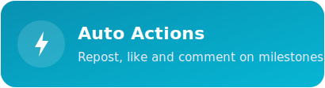
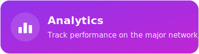
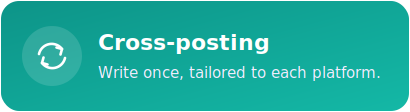
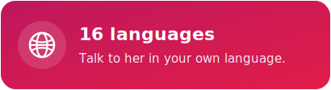
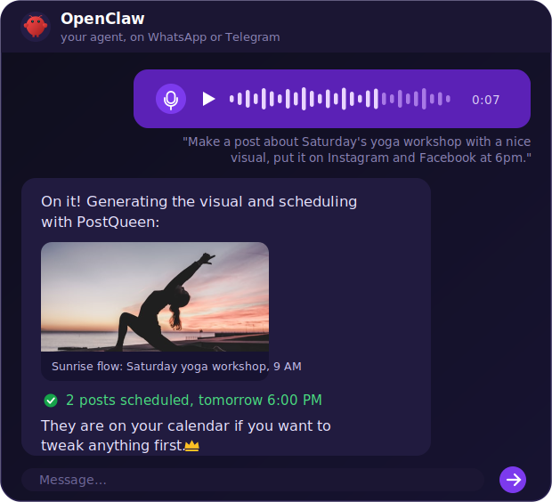
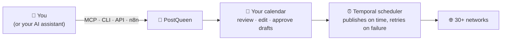

<p align="center">
  <a href="https://postqueen.ai">
    
  </a>
</p>

<h3 align="center">
  <a href="https://postqueen.ai/agent">🆕 NEW: meet the PostQueen Agent, run your social media from Claude Code, ChatGPT or OpenClaw »</a>
</h3>

<br/>

<p align="center">
  <strong>Don't run a content calendar. Just tell your AI what is happening.</strong>
</p>

<p align="center">
  One message becomes a month of content on 30+ networks. PostQueen finds the hook, writes a version for every platform, designs the image, and lines everything up on a visual calendar. You read it, tweak what you want, and get on with your day.
</p>

<p align="center">
  <strong>PostQueen</strong> is the open-source alternative to <strong>Buffer, Hootsuite, Sprout Social</strong> and <strong>Later</strong>.
</p>

<br/>

<p align="center">
  <a href="https://postqueen.ai">Website</a> &nbsp;·&nbsp;
  <a href="https://postqueen.ai/pricing">Pricing</a> &nbsp;·&nbsp;
  <a href="https://docs.postqueen.ai">Docs</a> &nbsp;·&nbsp;
  <a href="https://api.postqueen.ai/docs">API Reference</a> &nbsp;·&nbsp;
  <a href="https://postqueen.ai/agent">Agents</a> &nbsp;·&nbsp;
  <a href="https://postqueen.ai/mcp">MCP</a> &nbsp;·&nbsp;
  <a href="https://www.npmjs.com/package/postqueen">CLI</a>
</p>

<p align="center">
  <a href="https://github.com/GkhanKINAY/postqueen-app/blob/main/LICENSE"></a>
  <a href="https://www.npmjs.com/package/postqueen"></a>
  <a href="https://www.npmjs.com/package/@postqueen/node"></a>
  <a href="https://www.npmjs.com/package/n8n-nodes-postqueen"></a>
  <a href="https://github.com/GkhanKINAY/postqueen-app/commits/main"></a>
</p>

<br/>

<p align="center">
  <!-- CHANNEL ICONS: 30 individual imgs, natural flow, mobile-wrap -->
                               
</p>

<p align="center">
  <a href="https://postqueen.ai"></a>
  &nbsp;&nbsp;
  <a href="https://github.com/GkhanKINAY/postqueen-docker-compose"></a>
</p>

<br/>

---

## 👑 Meet your new social media manager

Social media is real work: finding an angle, writing eight versions of the same news, resizing images, remembering to actually hit publish. PostQueen is the teammate who takes all of that off your plate. She is the queen of your posts: you tell her what is happening, she does the rest, and everything she makes waits for you on a calendar you can read at a glance.

Here is what she handles for you, all of it real and shipping today:

         


All of it is open source under AGPL-3.0. Use the managed cloud, or run the whole thing on your own server: same code, same queen.

---

## 💬 Just talk to her

PostQueen lives in the app, but you don't have to. She is wired into the tools you already talk to: your AI assistant on your phone, your coding agent in your terminal, ChatGPT in your browser. Wherever you say it, she gets it done.

Say it in plain words, in your own language:

> *"Plan a month of content for our coffee shop and fill the calendar."*

> *"Take this photo of today's special and put it on Instagram at lunchtime."*

> *"We just hit 10k followers, write a warm thank-you post for all our channels."*

> *"Turn my latest YouTube video into posts for X, LinkedIn and Threads."*

**You stay in control.** Everything lands on your calendar first, where you can read it, tweak it, or delete it before it goes out. Want to sign off on every single post? Ask her to save drafts, and nothing publishes until you schedule it yourself.

<br/>

<p align="center">
            
</p>

### 📱 From your phone

Message **OpenClaw** on WhatsApp, Telegram, Slack or Discord, from the couch, the airport, anywhere. It picks up your message, talks to PostQueen, uploads your media and schedules the posts while you keep scrolling:

<p align="center">
  
</p>

Set-up guide: [OpenClaw »](https://postqueen.ai/openclaw)

### ⌨️ From your terminal

Give your coding agent hands. Install PostQueen as a skill and **Claude Code, Codex, Cursor or Gemini CLI** can plan and publish for you between commits:

```bash
# Install the skill
npx skills add GkhanKINAY/postqueen-agent

# Set your API key
export POSTQUEEN_API_KEY=your_api_key

# Your agent can now run these for you:
postqueen integrations:list
postqueen posts:create \
  -c "We just shipped dark mode 🌙" \
  -s "2026-08-01T09:00:00Z" \
  -i "your-integration-id"
```

Set-up guides: [Claude Code »](https://postqueen.ai/claude-code) &nbsp;·&nbsp; [Codex »](https://postqueen.ai/codex) &nbsp;·&nbsp; [Cursor »](https://postqueen.ai/cursor)

### 🟢 From ChatGPT

One link, no install. Add PostQueen as a connector and ask ChatGPT to draft and schedule your week:

```text
Settings → Connectors → add:  https://api.postqueen.ai/mcp/<YOUR_API_KEY>
```

Set-up guide: [ChatGPT »](https://postqueen.ai/chatgpt)

### 🌙 An agent that works while you sleep

Agents like **Hermes** and **OpenClaw** can run on a schedule, not just on demand. A small recurring job wakes up every morning, checks yesterday's numbers with `analytics:platform`, and drafts today's post before you have had coffee. Every PostQueen action is a CLI command or an MCP call with clean JSON output, so any agent that can run a command can run your social media.

**Any other agent works too:** Gemini CLI, Aider, Cline, Warp, Windsurf, or your own scripts. Start from the [Agent guide](https://postqueen.ai/agent) or the [MCP guide](https://postqueen.ai/mcp), and see the full command reference in [postqueen-agent](https://github.com/GkhanKINAY/postqueen-agent).

---

## ⚙️ How she works



1. **You say it.** In the app, or through any connected assistant.
2. **She plans and writes.** The AI agent researches your topic, picks a hook, writes per-platform versions, and can generate the image or video to go with them.
3. **It lands on your calendar.** Scheduled posts wait in the queue where you can still edit or delete them; drafts wait for your explicit go.
4. **It publishes on time.** A [Temporal](https://temporal.io) workflow engine fires each post at the right moment, with automatic retries, and keeps refreshing your platform tokens in the background.

Curious about the internals? Read [how it works](https://docs.postqueen.ai/howitworks) in the docs.

---

## 🚀 Get started in minutes

### ☁️ Cloud, the fast lane

Skip the setup entirely. Create an account, connect your channels, and schedule your first post today: **7-day free trial**, nothing to install, nothing to run.

<p align="center">
  <a href="https://postqueen.ai"></a>
</p>

### 🐳 Self-host, the free lane

Your server. Your keys. Your audience. The whole stack runs on your machine with Docker:

```bash
git clone https://github.com/GkhanKINAY/postqueen-docker-compose
cd postqueen-docker-compose
# set a unique JWT_SECRET and your public URLs in docker-compose.yaml
docker compose up -d          # then open http://localhost:4007
```

You will need Docker, about 4 GB of RAM, and for connecting real social accounts a public HTTPS domain behind a reverse proxy (the networks send their OAuth callbacks there). The stack ships the app, PostgreSQL, Redis and Temporal.

Full walkthrough: [self-host guide](https://docs.postqueen.ai/installation/docker-compose) &nbsp;·&nbsp; Kubernetes: [postqueen-helmchart](https://github.com/GkhanKINAY/postqueen-helmchart) &nbsp;·&nbsp; every setting: [configuration reference](https://docs.postqueen.ai/configuration/reference)

---

## 🌐 Publish everywhere

Write once, be everywhere. PostQueen publishes to **30+ networks** out of the box:

- **Major social:** X, LinkedIn, Instagram, Facebook, TikTok, YouTube, Threads, Pinterest, Reddit, Bluesky
- **Community and chat:** Discord, Slack, Telegram, Mastodon, Twitch, Kick, MeWe, VK
- **Publishing and blogs:** WordPress, Medium, Dev.to, Hashnode, Tumblr, Listmonk, Moltbook
- **Web3 and decentralized:** Nostr, Farcaster, Lemmy
- **Creator and business:** Google Business Profile, Whop, Skool, Dribbble

LinkedIn and Instagram each support both personal and page posting. New connectors ship regularly: see the full list with per-network guides at [postqueen.ai/channels](https://postqueen.ai/channels).

---

## 🛠️ For developers and builders

Everything the app does is a public API call, which is why agents drive it so well. Pick your surface:

### 1. Get your API key

1. Open **[app.postqueen.ai/settings](https://app.postqueen.ai/settings)** (or your self-hosted instance).
2. Go to **Developers → Public API**.
3. Click **Reveal**, copy your key, and keep it secret: it grants full access to your account.

```bash
export POSTQUEEN_API_KEY="your_api_key"
```

### 2. Connect over MCP

The [Model Context Protocol](https://modelcontextprotocol.io) lets AI assistants call tools. PostQueen ships a hosted MCP server with **10 tools**: list your channels and groups, read each platform's posting rules, schedule or draft posts, generate images, generate videos, and upload media from a URL. Point any MCP client at it and your assistant can run your social media as if it were built in.

```bash
# Claude Code, one line:
claude mcp add --transport http postqueen https://api.postqueen.ai/mcp/<YOUR_API_KEY>
```

```json
{
  "mcpServers": {
    "postqueen": { "url": "https://api.postqueen.ai/mcp/<YOUR_API_KEY>" }
  }
}
```

Full guide with per-client steps: [postqueen.ai/mcp](https://postqueen.ai/mcp) &nbsp;·&nbsp; tool reference: [docs](https://docs.postqueen.ai/mcp/tools)

### 3. Script it with the CLI

The `postqueen` CLI drives the whole product and always returns clean JSON, which makes it equally good for shell scripts and AI agents:

```bash
npm i -g postqueen
postqueen auth:login          # browser device flow, or use POSTQUEEN_API_KEY
postqueen integrations:list
postqueen posts:create -c "Hello world 👑" -s "2026-08-01T09:00:00Z" -i <integration-id>
```

Full command reference: [postqueen-agent](https://github.com/GkhanKINAY/postqueen-agent) &nbsp;·&nbsp; [CLI docs](https://docs.postqueen.ai/cli/introduction)

### 4. Call the API or the SDK

REST at `https://api.postqueen.ai/public/v1`, with your API key as the `Authorization` header:

```bash
curl https://api.postqueen.ai/public/v1/integrations \
  -H "Authorization: $POSTQUEEN_API_KEY"
```

Schedule a post to two networks at once:

```bash
curl -X POST https://api.postqueen.ai/public/v1/posts \
  -H "Authorization: $POSTQUEEN_API_KEY" \
  -H "Content-Type: application/json" \
  -d '{
    "type": "schedule",
    "date": "2026-08-01T09:00:00.000Z",
    "shortLink": false,
    "tags": [],
    "posts": [
      {
        "integration": { "id": "x-integration-id" },
        "value": [{ "content": "We just shipped dark mode 🌙" }],
        "settings": { "__type": "x", "who_can_reply_post": "everyone" }
      },
      {
        "integration": { "id": "linkedin-integration-id" },
        "value": [{ "content": "Dark mode is here. Here is why we built it." }],
        "settings": { "__type": "linkedin" }
      }
    ]
  }'
```

Prefer typed code? The same API through the [NodeJS SDK](https://www.npmjs.com/package/@postqueen/node):

```typescript
import PostQueen from '@postqueen/node';

const postqueen = new PostQueen(process.env.POSTQUEEN_API_KEY!);

const channels = (await postqueen.integrations()) as { id: string; name: string }[];

await postqueen.post({
  type: 'schedule',
  date: '2026-08-01T09:00:00.000Z',
  shortLink: false,
  tags: [],
  posts: [
    {
      integration: { id: channels[0].id },
      value: [{ content: 'We just shipped 🎉', image: [] }],
    },
  ],
});
```

### 5. Automate without code

| Tool | What it is | Get started |
| --- | --- | --- |
| **n8n node** | Drop PostQueen into any n8n workflow | [postqueen-n8n](https://github.com/GkhanKINAY/postqueen-n8n) · [`n8n-nodes-postqueen`](https://www.npmjs.com/package/n8n-nodes-postqueen) |
| **Public API** | REST, 22 endpoints, Swagger included | [API reference](https://api.postqueen.ai/docs) · [docs](https://docs.postqueen.ai/public-api/introduction) |
| **NodeJS SDK** | Typed client for Node | [`@postqueen/node`](https://www.npmjs.com/package/@postqueen/node) |
| **Webhooks** | Get notified when posts publish | [configuration reference](https://docs.postqueen.ai/configuration/reference) |

The same API plugs into Make.com, Zapier or your own cron jobs.

---

## 🧱 Under the hood

- **pnpm workspaces** monorepo
- **[Next.js](https://nextjs.org)** (React) frontend
- **[NestJS](https://nestjs.com)** backend API
- **[Prisma](https://www.prisma.io)** ORM on **PostgreSQL**
- **[Temporal](https://temporal.io)** for durable scheduling: posts fire on time even through crashes and restarts
- **Redis** for cache and queues
- **[Resend](https://resend.com)** for email notifications

---

## 🛡️ Compliance

- PostQueen is an open-source, self-hostable social media scheduler that supports X, LinkedIn, Instagram, Bluesky, Mastodon, Discord and 30+ more.
- The hosted service uses official, platform-approved OAuth flows.
- PostQueen does not automate or scrape content from social media platforms.
- PostQueen does not collect, store, or proxy API keys or access tokens from users.
- PostQueen never asks users to paste social-platform credentials into the hosted product.
- Users always authenticate directly with each platform (X, LinkedIn, Discord, and so on), which keeps every platform's compliance and your data privacy intact.

---

## ❤️ Community and support

- 🐛 **Found a bug or have an idea?** [Open an issue](https://github.com/GkhanKINAY/postqueen-app/issues).
- 💌 **Need a hand?** Email **support@postqueen.ai**.
- 📚 **Getting started?** The [docs](https://docs.postqueen.ai) walk you through everything.

If PostQueen saves you time, a ⭐ on the repo genuinely helps other people find it.

---

## 🙏 Thank you, Postiz

PostQueen is a fork of [Postiz](https://github.com/gitroomhq/postiz-app) by Nevo David, released under AGPL-3.0. Postiz gave us a rock-solid open-source scheduler: the connectors, the calendar, the Temporal pipeline, years of careful work that we did not have to redo. We forked it because we wanted to take that foundation in a specific direction, a social media manager you talk to instead of operate, and building on Postiz let us start from something that already worked.

Thank you, Nevo David and every Postiz contributor. This project exists because you chose to open-source yours. If PostQueen is not quite what you need, [Postiz](https://postiz.com) itself might be, and it deserves your star too. 🙏

---

## 👑 The PostQueen ecosystem

| Repository | What lives there |
| --- | --- |
| [postqueen-app](https://github.com/GkhanKINAY/postqueen-app) | The application itself: frontend, backend, workers |
| [postqueen-agent](https://github.com/GkhanKINAY/postqueen-agent) | Agent CLI and skill: give any AI assistant hands |
| [postqueen-docker-compose](https://github.com/GkhanKINAY/postqueen-docker-compose) | Self-host the whole stack with one command |
| [postqueen-helmchart](https://github.com/GkhanKINAY/postqueen-helmchart) | Run it on Kubernetes |
| [postqueen-n8n](https://github.com/GkhanKINAY/postqueen-n8n) | The n8n community node for no-code automation |
| [postqueen-docs](https://github.com/GkhanKINAY/postqueen-docs) | Source of [docs.postqueen.ai](https://docs.postqueen.ai) |

On npm: [`postqueen`](https://www.npmjs.com/package/postqueen) (CLI) · [`@postqueen/node`](https://www.npmjs.com/package/@postqueen/node) (SDK) · [`n8n-nodes-postqueen`](https://www.npmjs.com/package/n8n-nodes-postqueen) (n8n)

<br/>

<p align="center">
  <strong>Long live the queen.</strong> 👑
</p>

<p align="center">
  <a href="https://postqueen.ai"></a>
  &nbsp;&nbsp;
  <a href="https://github.com/GkhanKINAY/postqueen-docker-compose"></a>
</p>

## License

This repository's source code is available under the [AGPL-3.0 license](LICENSE). Original work © Nevo David / Gitroom and the Postiz contributors. Modifications © PostQueen.
