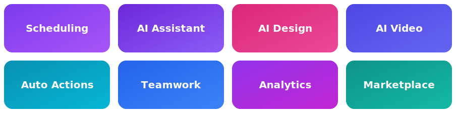

<p align="center">
  <a href="https://postqueen.ai">
    
  </a>
</p>

<h3 align="center">🆕&nbsp; NEW: the PostQueen <a href="https://postqueen.ai/agent">Agent CLI</a> + <a href="https://postqueen.ai/mcp">MCP server</a>: plug Claude&nbsp;Code, ChatGPT, Cursor, OpenClaw, Hermes or Codex straight into your channels.</h3>

<br/>

<div align="center">
  <h2>The queen of your posts 👑</h2>
  <p>
    She writes your best hooks, makes the images, edits the videos, and lines everything up on your<br/>
    calendar for the day and time you choose. You say the word; she does the rest, and
    <strong>nothing goes out without your approval</strong>.
  </p>
  <p><em>An open-source alternative to Buffer, Hootsuite, Sprout Social and Later.</em></p>
</div>

<br/>

<p align="center">
  <a href="https://postqueen.ai">Website</a> &nbsp;·&nbsp;
  <a href="https://postqueen.ai/pricing">Pricing</a> &nbsp;·&nbsp;
  <a href="https://app.postqueen.ai/auth">Start free</a> &nbsp;·&nbsp;
  <a href="https://docs.postqueen.ai">Docs</a> &nbsp;·&nbsp;
  <a href="https://api.postqueen.ai/docs">API Reference</a> &nbsp;·&nbsp;
  <a href="https://www.npmjs.com/package/postqueen">CLI</a>
</p>

<p align="center">
  <a href="https://github.com/GkhanKINAY/postqueen-app/blob/main/LICENSE"></a>
  <a href="https://www.npmjs.com/package/postqueen"></a>
  <a href="https://www.npmjs.com/package/@postqueen/node"></a>
  <a href="https://www.npmjs.com/package/n8n-nodes-postqueen"></a>
  <a href="https://github.com/GkhanKINAY/postqueen-app/commits/main"></a>
</p>

<p align="center">
  <a href="https://postqueen.ai"></a>
</p>

<br/>

<p align="center">
  
</p>

<p align="center">
  <a href="https://docs.postqueen.ai"><strong>Explore the docs »</strong></a>
</p>

---

## 👑 Everything PostQueen does for you

<p align="center">
  
</p>

- 📅 **Scheduling.** Plan every channel on one visual calendar; drag to reschedule, click to edit.
- 🤖 **AI Assistant.** Generate hooks, captions and threads in your voice, shaped per platform.
- 🎨 **AI Design.** A built-in, Canva-like editor plus AI image generation for post visuals.
- 🎬 **AI Video.** Turn a photo and a script into a short vertical video for Reels, Shorts and TikTok.
- ⚡ **Auto Actions (Plugs).** Auto repost, like and comment when a post hits a milestone.
- 👥 **Teamwork.** Roles, comments, approvals and multi-brand workspaces for your whole team.
- 📈 **Analytics.** Track post and audience performance on the major networks.
- 🛒 **Marketplace.** Buy or exchange posts with other members.

---

## 💬 Just talk to your AI

You don't need to write a line of code. Connect PostQueen to the AI assistant you already use, then just ask:

> *"Post about our launch on X and LinkedIn tomorrow morning."*

> *"Turn this blog post into a week of posts, one a day."*

> *"Make an image for this post and schedule it for Friday at 9am."*

Your assistant writes it, designs it, and drops it into your **PostQueen queue**, where you review and approve before anything goes live.

> 🔑 **First, grab your API key** at **[app.postqueen.ai/settings](https://app.postqueen.ai/settings)** (Developers → Public API → Reveal).

---

## 🤝 Works with your AI

This is what makes PostQueen different: **drive it from whatever AI you already talk to.** Every agent below connects over the same CLI and hosted MCP server.

### 🟣 Claude Code

Tell it, in plain English:

> *"Schedule a tweet for tomorrow morning announcing our new feature, and attach the screenshot from `./assets/launch.png`."*

Claude Code connects over the CLI or MCP and runs, under the hood:

```bash
postqueen integrations:list
postqueen upload ./assets/launch.png
postqueen posts:create \
  -c "We just launched our new feature..." \
  -m "<uploaded-url>" \
  -s "2026-03-02T09:00:00Z" \
  -i "<x-integration-id>"
```

The draft lands in your queue for approval. [Set up Claude Code »](https://postqueen.ai/claude-code)

### 🦞 OpenClaw

Message it from WhatsApp, Telegram, Slack or Discord:

> *"Create 4 posts about fitness for TikTok, LinkedIn, X and Instagram and schedule them for this week."*

It drafts all four, tailored per platform, and queues them for your approval. [Set up OpenClaw »](https://postqueen.ai/openclaw)

### And the rest of your stack

- **[ChatGPT](https://postqueen.ai/chatgpt):** draft in ChatGPT, then let PostQueen fan the result out to every channel.
- **[Cursor](https://postqueen.ai/cursor):** manage your channels from the editor you build in, over the CLI or MCP.
- **[Hermes](https://postqueen.ai/hermes-agent):** hand your posting pipeline to an agent that plans multi-step tasks end to end.
- **[Codex](https://postqueen.ai/codex):** one prompt in, a scheduled week out.

Not on the list? PostQueen's CLI and MCP server are model-agnostic, so **any MCP client or command-running agent works**: Gemini CLI, Aider, Cline, Warp, Windsurf, or your own.

---

## 🔌 Connect over MCP

The [Model Context Protocol](https://modelcontextprotocol.io) lets AI assistants call tools. PostQueen ships a hosted MCP server, so any MCP client can draft, schedule and manage posts as if it were built in.

**One-line connect (Claude Code or any CLI client):**

```bash
claude mcp add --transport http postqueen https://api.postqueen.ai/mcp/<YOUR_API_KEY>
```

**Config-file clients (Claude Desktop, Cursor, and others):**

```json
{
  "mcpServers": {
    "postqueen": {
      "url": "https://api.postqueen.ai/mcp/<YOUR_API_KEY>"
    }
  }
}
```

**ChatGPT:** Settings → Connectors → add a custom connector pointing at `https://api.postqueen.ai/mcp/<YOUR_API_KEY>`. Full guide: [postqueen.ai/mcp](https://postqueen.ai/mcp).

---

## ⌨️ Agent CLI

Prefer the terminal, or building an agent that runs commands? The `postqueen` CLI drives everything and returns clean JSON.

```bash
npm i -g postqueen
postqueen auth:login          # opens a browser device flow
postqueen integrations:list   # your connected channels
postqueen posts:create -c "Hello from PostQueen" -s "2026-01-01T09:00:00Z" -i <integration-id>
```

Install it as a skill for terminal agents with `npx skills add GkhanKINAY/postqueen-agent`. Full reference: [postqueen-agent](https://github.com/GkhanKINAY/postqueen-agent).

## 🤖 Build your own agent

Because every action is a public API call, you can point **your own** agent at PostQueen and let it plan, draft and schedule on a recurring basis. A heartbeat job (a cron entry or an always-on loop) can wake up, decide what to post, and queue it, with a human still approving before anything ships. Start from the [Agent CLI](https://postqueen.ai/agent) or [MCP](https://postqueen.ai/mcp) guides.

## 🧩 Public API, SDK & n8n

| Tool | What it is | Get started |
| --- | --- | --- |
| **Public API** | REST at `https://api.postqueen.ai/public/v1` | [API reference](https://api.postqueen.ai/docs) |
| **NodeJS SDK** | Typed client for Node | [`@postqueen/node`](https://www.npmjs.com/package/@postqueen/node) |
| **n8n node** | No-code automation node | [`n8n-nodes-postqueen`](https://www.npmjs.com/package/n8n-nodes-postqueen) |
| **Webhooks** | Get notified when posts publish | [docs](https://docs.postqueen.ai) |

```bash
curl https://api.postqueen.ai/public/v1/integrations \
  -H "Authorization: $POSTQUEEN_API_KEY"
```

Plug the same API into Make.com, Zapier or your own scripts.

---

## 🌐 Supported networks

PostQueen publishes to **30+ social networks** out of the box:

| Group | Networks |
| --- | --- |
| **Major social** | X · LinkedIn · Instagram · Facebook · TikTok · YouTube · Threads · Pinterest · Reddit · Bluesky |
| **Community & chat** | Discord · Slack · Telegram · Mastodon · Twitch · Kick · MeWe · VK |
| **Publishing & blogs** | WordPress · Medium · Dev.to · Hashnode · Tumblr · Listmonk · Moltbook |
| **Web3 & decentralized** | Nostr · Farcaster · Lemmy |
| **Creator & business** | Google Business Profile · Whop · Skool · Dribbble |

LinkedIn and Instagram each support both personal and page/professional posting, so the number of connectors runs a little higher. New connectors ship regularly.

---

## 🚀 Get started

<p align="center">
  <a href="https://postqueen.ai"></a>
</p>

<p align="center">Skip the setup: connect your channels and schedule your first post in minutes.</p>

<details>
<summary><strong>🐳 Prefer to self-host? Free, with Docker Compose</strong></summary>

<br/>

```bash
git clone https://github.com/GkhanKINAY/postqueen-docker-compose
cd postqueen-docker-compose
# open docker-compose.yaml and set a unique JWT_SECRET + your public URLs
docker compose up -d       # then open http://localhost:4007
```

Full [self-host guide](https://docs.postqueen.ai/quickstart), [Kubernetes / Helm](https://github.com/GkhanKINAY/postqueen-helmchart), and [configuration reference](https://docs.postqueen.ai/configuration/reference). Local development of this repo: [CONTRIBUTING.md](CONTRIBUTING.md).
</details>

---

## 🧱 Tech stack

pnpm workspaces (monorepo) · [Next.js](https://nextjs.org) (frontend) · [NestJS](https://nestjs.com) (backend) · [Prisma](https://www.prisma.io) (PostgreSQL) · [Temporal](https://temporal.io) (scheduling and publishing workers) · Redis (cache and queues) · [Resend](https://resend.com) (email).

---

## 🛡️ Compliance

- PostQueen is an open-source, self-hostable social media scheduler that supports X, LinkedIn, Instagram, Bluesky, Mastodon, Discord and 30+ more.
- The hosted service uses official, platform-approved OAuth flows.
- PostQueen does not automate or scrape content from social media platforms.
- PostQueen does not collect, store, or proxy API keys or access tokens from users.
- PostQueen never asks users to paste social-platform credentials into the hosted product.
- Users always authenticate directly with each platform (X, LinkedIn, Discord, and so on), which keeps every platform's compliance and your data privacy intact.

---

## ❤️ Community & Support

We would love to hear from you, whether you hit a bug, have an idea, or just want to say hi:

- 🐛 **Found a bug or have a feature idea?** [Open an issue](https://github.com/GkhanKINAY/postqueen-app/issues).
- 💌 **Need a hand?** Email **support@postqueen.ai**.
- 📚 **Getting started?** The [docs](https://docs.postqueen.ai) walk you through everything.

If PostQueen saves you time, a ⭐ on the repo genuinely helps other people find it.

## Contributing & Security

- [Contributing guide](CONTRIBUTING.md)
- [Code of Conduct](CODE_OF_CONDUCT.md)
- Found a vulnerability? See [SECURITY.md](SECURITY.md)

## 💜 Why we built PostQueen, and a thank you

AI is moving faster every day, and we believe **agentic AI will be an indispensable part of daily life from 2030 onward**. We set out to build an agentic product of our own, in the spirit of tools like Chatbase and Wispr Flow.

When we found that **Nevo David had open-sourced [Postiz](https://github.com/gitroomhq/postiz-app) under AGPL-3.0**, it was exactly the foundation we had been looking for. PostQueen builds on that foundation and grows it in its own direction: an AI assistant that writes, designs and schedules your social media for you. Our aim is a genuinely distinct product, not a fork with a paywall bolted on.

So, from the bottom of our hearts: **thank you, Nevo David and the Postiz contributors**, for building something great and keeping it open. 🙏💜 We are proud to build on your work.

## License

This repository's source code is available under the [AGPL-3.0 license](LICENSE). Original work © Nevo David / Gitroom and the Postiz contributors. Modifications © PostQueen.
