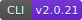
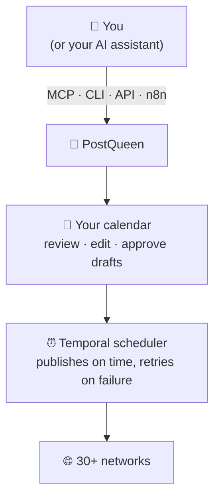

<p align="center">
  <a href="https://postqueen.ai">
    
  </a>
</p>

<h3 align="center">
  <a href="https://postqueen.ai/agent">🆕 NEW: meet the PostQueen Agent, run your social media from Claude Code, ChatGPT, OpenClaw or Hermes »</a>
</h3>

<br/>

<p align="center">
  <strong>Stop doing social media yourself.</strong>
</p>

<p align="center">
  PostQueen is an AI employee for your social media. Tell her what to share, in one sentence. She writes the copy, designs the visual and schedules it on every channel you have. You just review the calendar.
</p>

<p align="center">
  <strong><a href="https://postqueen.ai">PostQueen</a></strong> is the open-source alternative to <strong>Buffer, Hootsuite, Sprout Social</strong> and <strong>Later</strong>.
</p>

<br/>

<p align="center"></p>

<br/>

<p align="center">
  <a href="https://postqueen.ai">Website</a> &nbsp;·&nbsp;
  <a href="https://postqueen.ai/pricing">Pricing</a> &nbsp;·&nbsp;
  <a href="https://docs.postqueen.ai">Docs</a> &nbsp;·&nbsp;
  <a href="https://api.postqueen.ai/docs">API Reference</a> &nbsp;·&nbsp;
  <a href="https://postqueen.ai/agent">Agents</a> &nbsp;·&nbsp;
  <a href="https://postqueen.ai/mcp">MCP</a> &nbsp;·&nbsp;
  <a href="https://www.npmjs.com/package/postqueen">CLI</a>
</p>

<p align="center">
  <a href="https://github.com/GkhanKINAY/postqueen-app/blob/main/LICENSE"></a>
  <a href="https://www.npmjs.com/package/postqueen"></a>
  <a href="https://www.npmjs.com/package/@postqueen/node"></a>
  <a href="https://www.npmjs.com/package/n8n-nodes-postqueen"></a>
</p>

<br/>

<p align="center">
  <!-- CHANNEL ICONS: 30 individual imgs, natural flow, mobile-wrap -->
                               
</p>


<br/>

<p align="center"></p>

<br/>

<h3 align="center">Schedule and generate posts with AI</h3>

<p align="center">
  
</p>

<br/>

<p align="center">
  <strong>Free for 7 days in the cloud. Forever free on your own server.</strong>
</p>

<p align="center">
  <a href="https://postqueen.ai"></a>
  &nbsp;&nbsp;
  <a href="https://github.com/GkhanKINAY/postqueen-docker-compose"></a>
</p>

<br/>

---

## 💬 Just talk to her

Message her like a colleague from wherever you already type or talk: WhatsApp or Telegram, the Claude app on your phone, your terminal through Claude Code, ChatGPT through MCP. Say what you want posted, and consider it handled.

<p align="center">
            
</p>

<p align="center">
  
</p>

That first message is a voice note, and that is the point: if your assistant supports voice, you can say it out loud. Voice note in, posts out.

Try saying:

> *"Plan a month of content for our coffee shop and fill the calendar."*

> *"Take this photo of today's special and put it on Instagram at lunchtime."*

> *"We just hit 10k followers, write a warm thank-you post for all our channels."*

> *"Turn my latest YouTube video into posts for X, LinkedIn and Threads."*

**You get the final word.** Everything lands on your calendar first: read it, tweak it, or delete it before it goes out. Prefer to approve every post? Ask for drafts, and nothing publishes until you schedule it yourself.

<br/>

<p align="center"></p>

<br/>

## 📱 From your phone

There is no PostQueen app to install, and that is the point: whichever assistant you already carry in your pocket becomes her phone number. Message it there, and it manages your whole PostQueen calendar — drafting, scheduling and publishing from inside the chat.

<p align="center">
  
</p>

Pick your app — every card is a click away from its two-minute set-up guide:

<a href="https://postqueen.ai/openclaw"></a> <a href="https://postqueen.ai/openclaw"></a> <a href="https://postqueen.ai/mcp"></a> <a href="https://postqueen.ai/chatgpt"></a> <a href="https://postqueen.ai/openclaw"></a> <a href="https://postqueen.ai/openclaw"></a>

<br/>

<p align="center"></p>

<br/>

## 🦞 Meet her open agents: OpenClaw &amp; Hermes

The two open-source agents everyone is running right now both speak PostQueen natively. **OpenClaw** lives on your machine and answers you from any chat app. **Hermes** does that too — and give it one brief, it plans your whole week on its own. Both drive the same `postqueen` CLI.

<p align="center">
  
</p>

<a href="https://postqueen.ai/openclaw"></a> <a href="https://postqueen.ai/hermes-agent"></a>

**Any other agent works too** — anything that can run a CLI command or call MCP can run your socials. [Agent guide »](https://postqueen.ai/agent)

<br/>

<p align="center"></p>

<br/>

## 💻 From your terminal

Give your coding agent hands. Install PostQueen as a skill and **Claude Code, Codex, Cursor, Gemini CLI, Warp, Cline, Windsurf or Aider** can plan and publish for you between commits:

<p align="center">
  
</p>

```bash
# Install the skill
npx skills add GkhanKINAY/postqueen-agent

# Set your API key
export POSTQUEEN_API_KEY=your_api_key

# Your agent can now run these for you:
postqueen integrations:list
postqueen posts:create \
  -c "We just shipped dark mode 🌙" \
  -s "2026-08-01T09:00:00Z" \
  -i "your-integration-id"
```

Pick your agent — each card opens its guide:

<a href="https://postqueen.ai/claude-code"></a> <a href="https://postqueen.ai/codex"></a> <a href="https://postqueen.ai/cursor"></a> <a href="https://postqueen.ai/agent"></a> <a href="https://postqueen.ai/hermes-agent"></a> <a href="https://postqueen.ai/agent"></a> <a href="https://postqueen.ai/agent"></a> <a href="https://postqueen.ai/agent"></a> <a href="https://postqueen.ai/agent"></a> <a href="https://github.com/GkhanKINAY/postqueen-agent"></a>

<br/>

<p align="center"></p>

<br/>

##  From ChatGPT

One link, no install. Add PostQueen as a connector and ask ChatGPT to draft and schedule your week:

<p align="center">
  
</p>

```text
Settings → Connectors → add:  https://api.postqueen.ai/mcp/<YOUR_API_KEY>
```

Set-up guide: [ChatGPT »](https://postqueen.ai/chatgpt)

<br/>

<p align="center"></p>

<br/>

##  From Claude

The same one-link connector works on claude.ai — and it follows you into the Claude apps on iOS, Android and desktop. Ask Claude to plan and schedule your week:

<p align="center">
  
</p>

```text
claude.ai → Settings → Connectors → add:  https://api.postqueen.ai/mcp/<YOUR_API_KEY>
```

Set-up guide: [Claude »](https://postqueen.ai/mcp)

<br/>

<p align="center"></p>

<br/>

## 🔌 From your automations

No agent, no problem — the same public API that powers everything above plugs straight into your tools. Hook **n8n** up once and every post and video your workflow produces goes out to every channel you have, scheduled and published by PostQueen in a single step:

<p align="center">
  
</p>

The workflows n8n builders actually grow channels with — a fresh AI video queued to YouTube every morning, and every new clip fanned out to TikTok, Reels and Shorts:

<p align="center">
  
</p>

<p align="center">
  
</p>

Set-up, nine example workflows and the full operation list live in the [n8n node repo »](https://github.com/GkhanKINAY/postqueen-n8n)

<a href="https://api.postqueen.ai/docs"></a> <a href="https://github.com/GkhanKINAY/postqueen-n8n"></a> <a href="https://docs.postqueen.ai/public-api/introduction"></a> <a href="https://docs.postqueen.ai/public-api/introduction"></a>

<br/>

<p align="center"></p>

<br/>

## 🌙 An agent that works while you sleep

Agents like **Hermes** and **OpenClaw** can run on a schedule, not just on demand. A small recurring job wakes up every morning, checks yesterday's numbers with `analytics:platform`, and drafts today's post before you have had coffee. Every PostQueen action is a CLI command or an MCP call with clean JSON output, so any agent that can run a command can run your social media.

<p align="center">
  
</p>

**Any other agent works too:** Gemini CLI, Aider, Cline, Warp, Windsurf, or your own scripts. Start from the [Agent guide](https://postqueen.ai/agent) or the [MCP guide](https://postqueen.ai/mcp), and see the full command reference in [postqueen-agent](https://github.com/GkhanKINAY/postqueen-agent).

<br/>

---

## 👥 Who is she for?

If posting is part of your job but not your whole job, she is for you. Creators who want to stay visible without living in the apps, owners who would rather run the business than the brand account, developers and automation teams who treat publishing as a building block, and anyone who would rather just tell an agent what to post:

<p align="center">
  
</p>

<br/>

---

## 👑 What she takes off your plate

Everything below ships today, in the cloud and in the open-source code. We call her the queen of your posts because she earns the title: sharper hooks, better timing and more consistency than hand-run social media.

<br/>

<p align="center"></p>

<br/>

### One calendar, every channel

Write a post once and she tailors it to each platform's limits and format, and gives each one its own day and time if you want. Point her at your blog's RSS feed and new articles post themselves.

<p align="center">
  
</p>

<br/>

<p align="center"></p>

<br/>

### She writes, designs and films

Give her a topic and she comes back with the hook, the caption, an on-brand image, even a short vertical video with AI voiceover. And in whatever language you use: she answers in yours, and the app itself ships in 16.

<p align="center">
  
</p>

<br/>

<p align="center"></p>

<br/>

### She keeps score and keeps working

Follower growth, impressions and per-post engagement sit right next to your calendar. And Auto Actions can repost, like or comment for you when a post hits the milestone you set:

<p align="center">
  
</p>

<br/>

<p align="center"></p>

<br/>

#### 🤝 Teamwork

Invite the team: roles, shared calendars and multi-brand workspaces, so everyone runs on the same queen.

<p align="center">
  
</p>

All of it is open source under AGPL-3.0. Use the managed cloud, or run the whole thing on your own server: same code, same queen.

<br/>

---

## ⚙️ How she works



1. **Say it once.** From the app, WhatsApp, your terminal or ChatGPT.
2. **She does the work.** Research, platform-specific copy, and an image or video to match.
3. **You get the final word.** Everything waits on your calendar: edit it, delete it, or keep drafts until you approve them.
4. **It goes out on time.** A [Temporal](https://temporal.io) workflow engine fires every post exactly when planned, with automatic retries, and refreshes your platform tokens in the background.

Curious about the internals? Read [how it works](https://docs.postqueen.ai/howitworks) in the docs.

<br/>

---

## 🚀 Get started in minutes

<br/>

<p align="center"></p>

<br/>

### ☁️ Cloud, the fast lane

Skip the setup entirely. Create an account, connect your channels, and schedule your first post today: **7-day free trial**, nothing to install, nothing to run.

<p align="center">
  <a href="https://postqueen.ai"></a>
</p>

<br/>

<p align="center"></p>

<br/>

### 🐳 Self-host, the free lane

Your server. Your keys. Your audience. The whole stack runs on your machine with Docker:

```bash
git clone https://github.com/GkhanKINAY/postqueen-docker-compose
cd postqueen-docker-compose
# set a unique JWT_SECRET and your public URLs in docker-compose.yaml
docker compose up -d          # then open http://localhost:4007
```

<p align="center">
  
</p>

You will need Docker, about 4 GB of RAM, and for connecting real social accounts a public HTTPS domain behind a reverse proxy (the networks send their OAuth callbacks there). The stack ships the app, PostgreSQL, Redis and Temporal.

Full walkthrough: [self-host guide](https://docs.postqueen.ai/installation/docker-compose) &nbsp;·&nbsp; Kubernetes: [postqueen-helmchart](https://github.com/GkhanKINAY/postqueen-helmchart) &nbsp;·&nbsp; every setting: [configuration reference](https://docs.postqueen.ai/configuration/reference)

<br/>

---

## 🌐 Publish everywhere

Write once, be everywhere. PostQueen publishes to **30+ networks** out of the box:

<p align="center">
                               
</p>

| Category | Networks |
| --- | --- |
| **Major social** | X, LinkedIn, Instagram, Facebook, TikTok, YouTube, Threads, Pinterest, Reddit, Bluesky |
| **Community and chat** | Discord, Slack, Telegram, Mastodon, Twitch, Kick, MeWe, VK |
| **Publishing and blogs** | WordPress, Medium, Dev.to, Hashnode, Tumblr, Listmonk, Moltbook |
| **Web3 and decentralized** | Nostr, Farcaster, Lemmy |
| **Creator and business** | Google Business Profile, Whop, Skool, Dribbble |

LinkedIn and Instagram each support both personal and page posting. New connectors ship regularly: see the full list with per-network guides at [postqueen.ai/channels](https://postqueen.ai/channels).

<br/>

---

## 🛠️ For developers and builders

Everything the app does is a public API call, which is why agents drive it so well. Pick your surface:

<br/>

<p align="center"></p>

<br/>

### 1. Get your API key

1. Open **[app.postqueen.ai/settings](https://app.postqueen.ai/settings)** (or your self-hosted instance).
2. Go to **Developers → Public API**.
3. Click **Reveal**, copy your key, and keep it secret: it grants full access to your account.

```bash
export POSTQUEEN_API_KEY="your_api_key"
```

<br/>

<p align="center"></p>

<br/>

### 2. Connect over MCP

The [Model Context Protocol](https://modelcontextprotocol.io) lets AI assistants call tools. PostQueen ships a hosted MCP server with **10 tools**: list your channels and groups, read each platform's posting rules, schedule or draft posts, generate images, generate videos, and upload media from a URL. Point any MCP client at it and your assistant can run your social media as if it were built in.

```bash
# Claude Code, one line:
claude mcp add --transport http postqueen https://api.postqueen.ai/mcp/<YOUR_API_KEY>
```

```json
{
  "mcpServers": {
    "postqueen": { "url": "https://api.postqueen.ai/mcp/<YOUR_API_KEY>" }
  }
}
```

Full guide with per-client steps: [postqueen.ai/mcp](https://postqueen.ai/mcp) &nbsp;·&nbsp; tool reference: [docs](https://docs.postqueen.ai/mcp/tools)

<br/>

<p align="center"></p>

<br/>

### 3. Script it with the CLI

The `postqueen` CLI drives the whole product and always returns clean JSON, which makes it equally good for shell scripts and AI agents:

```bash
npm i -g postqueen
export POSTQUEEN_API_KEY=your_api_key   # from app.postqueen.ai/settings
postqueen integrations:list
postqueen posts:create -c "Hello world 👑" -s "2026-08-01T09:00:00Z" -i <integration-id>
```

Full command reference: [postqueen-agent](https://github.com/GkhanKINAY/postqueen-agent) &nbsp;·&nbsp; [CLI docs](https://docs.postqueen.ai/cli/introduction)

<br/>

<p align="center"></p>

<br/>

### 4. Call the API or the SDK

REST at `https://api.postqueen.ai/public/v1`, with your API key as the `Authorization` header:

<p align="center">
  
</p>

```bash
curl https://api.postqueen.ai/public/v1/integrations \
  -H "Authorization: $POSTQUEEN_API_KEY"
```

Schedule a post to two networks at once:

```bash
curl -X POST https://api.postqueen.ai/public/v1/posts \
  -H "Authorization: $POSTQUEEN_API_KEY" \
  -H "Content-Type: application/json" \
  -d '{
    "type": "schedule",
    "date": "2026-08-01T09:00:00.000Z",
    "shortLink": false,
    "tags": [],
    "posts": [
      {
        "integration": { "id": "x-integration-id" },
        "value": [{ "content": "We just shipped dark mode 🌙" }],
        "settings": { "__type": "x", "who_can_reply_post": "everyone" }
      },
      {
        "integration": { "id": "linkedin-integration-id" },
        "value": [{ "content": "Dark mode is here. Here is why we built it." }],
        "settings": { "__type": "linkedin" }
      }
    ]
  }'
```

Prefer typed code? The same API through the [NodeJS SDK](https://www.npmjs.com/package/@postqueen/node):

```typescript
import PostQueen from '@postqueen/node';

const postqueen = new PostQueen(process.env.POSTQUEEN_API_KEY!);

const channels = (await postqueen.integrations()) as { id: string; name: string }[];

await postqueen.post({
  type: 'schedule',
  date: '2026-08-01T09:00:00.000Z',
  shortLink: false,
  tags: [],
  posts: [
    {
      integration: { id: channels[0].id },
      value: [{ content: 'We just shipped 🎉', image: [] }],
    },
  ],
});
```

<br/>

<p align="center"></p>

<br/>

### 5. Automate without code

| Tool | What it is | Get started |
| --- | --- | --- |
| **n8n node** | Drop PostQueen into any n8n workflow | [postqueen-n8n](https://github.com/GkhanKINAY/postqueen-n8n) · [`n8n-nodes-postqueen`](https://www.npmjs.com/package/n8n-nodes-postqueen) |
| **Public API** | REST, 22 endpoints, Swagger included | [API reference](https://api.postqueen.ai/docs) · [docs](https://docs.postqueen.ai/public-api/introduction) |
| **NodeJS SDK** | Typed client for Node | [`@postqueen/node`](https://www.npmjs.com/package/@postqueen/node) |
| **Webhooks** | Get notified when posts publish | [configuration reference](https://docs.postqueen.ai/configuration/reference) |

The same API plugs into Make.com, Zapier or your own cron jobs.

<br/>

---

## 🧱 Under the hood

- **pnpm workspaces** monorepo
- **[Next.js](https://nextjs.org)** (React) frontend
- **[NestJS](https://nestjs.com)** backend API
- **[Prisma](https://www.prisma.io)** ORM on **PostgreSQL**
- **[Temporal](https://temporal.io)** for durable scheduling: posts fire on time even through crashes and restarts
- **Redis** for cache and queues
- **[Resend](https://resend.com)** for email notifications

<br/>

---

## 🛡️ Compliance

- PostQueen is an open-source, self-hostable social media scheduler that supports X, LinkedIn, Instagram, Bluesky, Mastodon, Discord and 30+ more.
- The hosted service uses official, platform-approved OAuth flows.
- PostQueen does not automate or scrape content from social media platforms.
- PostQueen does not collect, store, or proxy API keys or access tokens from users.
- PostQueen never asks users to paste social-platform credentials into the hosted product.
- Users always authenticate directly with each platform (X, LinkedIn, Discord, and so on), which keeps every platform's compliance and your data privacy intact.

<br/>

---

## ❤️ Community and support

- 🐛 **Found a bug or have an idea?** [Open an issue](https://github.com/GkhanKINAY/postqueen-app/issues).
- 💌 **Need a hand?** Email **support@postqueen.ai**.
- 📚 **Getting started?** The [docs](https://docs.postqueen.ai) walk you through everything.
- 🤝 **Want to contribute?** Start with the [contribution guide](https://github.com/GkhanKINAY/postqueen-app/blob/main/CONTRIBUTING.md); security reports go to [SECURITY.md](https://github.com/GkhanKINAY/postqueen-app/blob/main/SECURITY.md).

If PostQueen saves you time, a ⭐ on the repo genuinely helps other people find it.

<br/>

---

## 🙏 Thank you, Postiz

PostQueen is a fork of [Postiz](https://github.com/gitroomhq/postiz-app) by Nevo David, released under AGPL-3.0. Postiz gave us a rock-solid open-source scheduler: the connectors, the calendar, the Temporal pipeline, years of careful work that we did not have to redo. We forked it because we wanted to take that foundation in a specific direction, a social media manager you talk to instead of operate, and building on Postiz let us start from something that already worked.

Thank you, Nevo David and every Postiz contributor. This project exists because you chose to open-source yours. If PostQueen is not quite what you need, [Postiz](https://postiz.com) itself might be, and it deserves your star too. 🙏

<br/>

---

## 👑 The PostQueen ecosystem

| Repository | What lives there |
| --- | --- |
| [postqueen-app](https://github.com/GkhanKINAY/postqueen-app) | The application itself: frontend, backend, workers |
| [postqueen-agent](https://github.com/GkhanKINAY/postqueen-agent) | Agent CLI and skill: give any AI assistant hands |
| [postqueen-docker-compose](https://github.com/GkhanKINAY/postqueen-docker-compose) | Self-host the whole stack with one command |
| [postqueen-helmchart](https://github.com/GkhanKINAY/postqueen-helmchart) | Run it on Kubernetes |
| [postqueen-n8n](https://github.com/GkhanKINAY/postqueen-n8n) | The n8n community node for no-code automation |
| [postqueen-docs](https://github.com/GkhanKINAY/postqueen-docs) | Source of [docs.postqueen.ai](https://docs.postqueen.ai) |

On npm: [`postqueen`](https://www.npmjs.com/package/postqueen) (CLI) · [`@postqueen/node`](https://www.npmjs.com/package/@postqueen/node) (SDK) · [`n8n-nodes-postqueen`](https://www.npmjs.com/package/n8n-nodes-postqueen) (n8n)

<br/>

<p align="center">
  <strong>Long live the queen.</strong> 👑
</p>

<p align="center">
  <a href="https://postqueen.ai"></a>
  &nbsp;&nbsp;
  <a href="https://github.com/GkhanKINAY/postqueen-docker-compose"></a>
</p>

## License

This repository's source code is available under the [AGPL-3.0 license](LICENSE). Original work © Nevo David / Gitroom and the Postiz contributors. Modifications © PostQueen.
