<p align="center">
  <a href="https://postqueen.ai">
    
  </a>
</p>

<h3 align="center">
  <a href="https://postqueen.ai/agent">🆕 NEW: meet the PostQueen Agent, run your social media from Claude Code, ChatGPT, OpenClaw or Hermes »</a>
</h3>

<br/>

<p align="center">
  <strong>Stop doing social media yourself.</strong>
</p>

<p align="center">
  PostQueen is an AI employee for your social media. Tell her what to share, in one sentence. She writes the copy, designs the visual and schedules it on every channel you have. You just review the calendar.
</p>

<p align="center">
  <strong><a href="https://postqueen.ai">PostQueen</a></strong> is the open-source alternative to <strong>Buffer, Hootsuite, Sprout Social</strong> and <strong>Later</strong>.
</p>

<br/>

<p align="center"></p>

<br/>

<p align="center">
  <a href="https://postqueen.ai">Website</a> &nbsp;·&nbsp;
  <a href="https://postqueen.ai/pricing">Pricing</a> &nbsp;·&nbsp;
  <a href="https://docs.postqueen.ai">Docs</a> &nbsp;·&nbsp;
  <a href="https://api.postqueen.ai/docs">API Reference</a> &nbsp;·&nbsp;
  <a href="https://postqueen.ai/agent">Agents</a> &nbsp;·&nbsp;
  <a href="https://postqueen.ai/mcp">MCP</a> &nbsp;·&nbsp;
  <a href="https://www.npmjs.com/package/postqueen">CLI</a>
</p>

<p align="center">
  <a href="https://github.com/GkhanKINAY/postqueen-app/blob/main/LICENSE">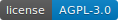</a>
  <a href="https://www.npmjs.com/package/postqueen"></a>
  <a href="https://www.npmjs.com/package/@postqueen/node"></a>
  <a href="https://www.npmjs.com/package/n8n-nodes-postqueen"></a>
</p>

<br/>

<p align="center">
  <!-- CHANNEL ICONS: 30 individual imgs, natural flow, mobile-wrap -->
                               
</p>


<br/>

<p align="center"></p>

<br/>

<h3 align="center">Schedule and generate posts with AI</h3>

<p align="center">
  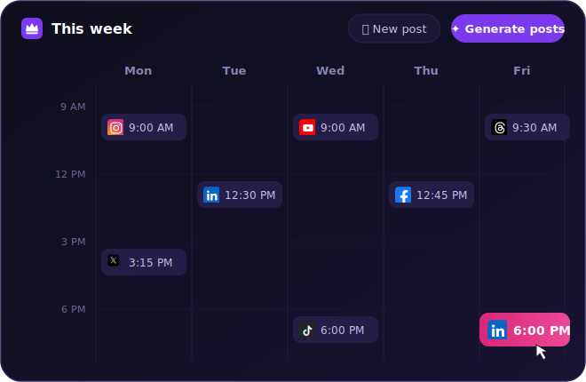
</p>

<br/>

<p align="center">
  <strong>Free for 7 days in the cloud. Forever free on your own server.</strong>
</p>

<p align="center">
  <a href="https://postqueen.ai"></a>
  &nbsp;&nbsp;
  <a href="https://github.com/GkhanKINAY/postqueen-docker-compose"></a>
</p>

<br/>

---

## 💬 Just talk to her

Message her the way you would message a colleague. She reads WhatsApp and Telegram through OpenClaw or Hermes, she answers inside ChatGPT and the Claude app, and she is one command away in your terminal. Tell her what you want the world to see, and she takes care of the rest: the words, the visual and the schedule.

<p align="center">
            
</p>

<p align="center">
  
</p>

That first message is a voice note. If your assistant supports voice, you can speak an idea on your walk and find it waiting on the calendar as finished posts by the time you sit back down.

Try saying:

> *"Plan a month of content for our coffee shop and fill the calendar."*

> *"Take this photo of today's special and put it on Instagram at lunchtime."*

> *"We just hit 10k followers, write a warm thank-you post for all our channels."*

> *"Turn my latest YouTube video into posts for X, LinkedIn and Threads."*

**She runs on your terms.** Leave her alone and she is a true autopilot: whatever she puts on the calendar goes out on time without another word from you. Want more say? Everything is visible on the calendar before it publishes, so you can edit or delete anything, and if you ask for drafts she holds every post until you approve it.

<br/>

<p align="center"></p>

<br/>

## 📱 From your phone

The PostQueen mobile app is on the way. You are not waiting on it, though, because she already answers on the phone in your pocket: message her on WhatsApp or Telegram through OpenClaw or Hermes, talk to her in the Claude or ChatGPT app, or open [app.postqueen.ai](https://app.postqueen.ai) in your browser. From any of them she runs your whole calendar: drafting, scheduling and publishing, no laptop required.

<p align="center">
  
</p>

Pick the app you live in. Each card opens a two-minute set-up guide:

<a href="https://postqueen.ai/openclaw"></a> <a href="https://postqueen.ai/openclaw">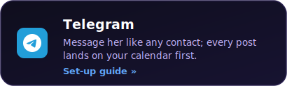</a> <a href="https://postqueen.ai/mcp">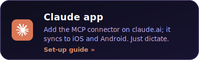</a> <a href="https://postqueen.ai/chatgpt"></a> <a href="https://postqueen.ai/openclaw"></a> <a href="https://postqueen.ai/openclaw">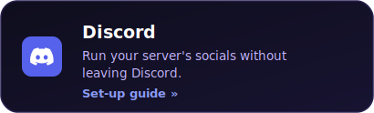</a>

<br/>

<p align="center"></p>

<br/>

## 🦞 Meet her open agents: OpenClaw &amp; Hermes

Two open-source agents already speak PostQueen natively. **OpenClaw** lives on your machine and turns any chat app into her front door. **Hermes** does the same, then goes further: hand it a single brief and it plans, writes and schedules your entire week on its own. Both drive the same `postqueen` CLI, so everything they do shows up on your calendar.

<p align="center">
  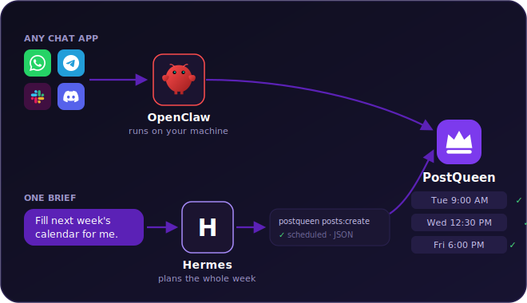
</p>

<a href="https://postqueen.ai/openclaw"></a> <a href="https://postqueen.ai/hermes-agent"></a>

**Any other agent works too.** If it can run a CLI command or call MCP, it can run your socials. [Agent guide »](https://postqueen.ai/agent)

<br/>

<p align="center"></p>

<br/>

## 💻 From your terminal

Give your coding agent hands: install PostQueen as a skill, and **Claude Code**, **Codex** or **Cursor** can plan and publish for you between commits:

<p align="center">
  
</p>

```bash
# Install the skill
npx skills add GkhanKINAY/postqueen-agent

# Set your API key
export POSTQUEEN_API_KEY=your_api_key

# Your agent can now run these for you:
postqueen integrations:list
postqueen posts:create \
  -c "We just shipped dark mode 🌙" \
  -s "2026-08-01T09:00:00Z" \
  -i "your-integration-id"
```

Pick your agent. Each card opens its guide:

<a href="https://postqueen.ai/claude-code">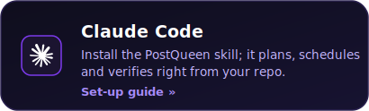</a> <a href="https://postqueen.ai/codex"></a> <a href="https://postqueen.ai/cursor">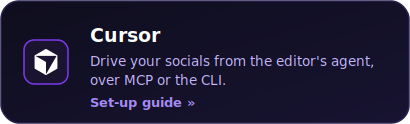</a> <a href="https://postqueen.ai/agent">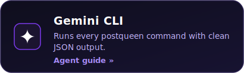</a> <a href="https://postqueen.ai/hermes-agent">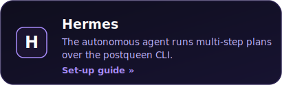</a> <a href="https://postqueen.ai/agent">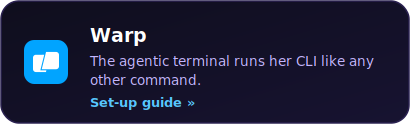</a> <a href="https://postqueen.ai/agent">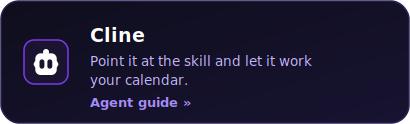</a> <a href="https://postqueen.ai/agent">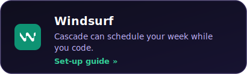</a> <a href="https://postqueen.ai/agent"></a> <a href="https://github.com/GkhanKINAY/postqueen-agent"></a>

<br/>

<p align="center"></p>

<br/>

##  From ChatGPT

Connecting ChatGPT takes a single link. Add PostQueen as a connector, then hand over your week: ChatGPT drafts the posts, generates the images and schedules everything while you keep chatting:

<p align="center">
  
</p>

```text
Settings → Connectors → add:  https://api.postqueen.ai/mcp/<YOUR_API_KEY>
```

Set-up guide: [ChatGPT »](https://postqueen.ai/chatgpt)

<br/>

<p align="center"></p>

<br/>

##  From Claude

The same one-link connector works on claude.ai, and it follows you into the Claude apps on iOS, Android and desktop. Wherever you talk to Claude, she is in the room, ready to plan and schedule your week:

<p align="center">
  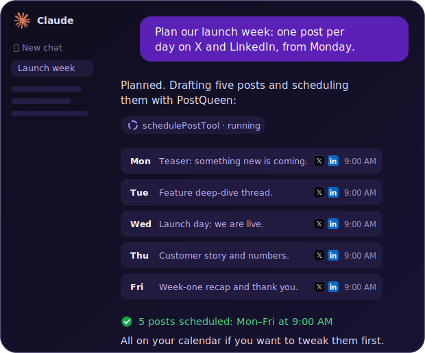
</p>

```text
claude.ai → Settings → Connectors → add:  https://api.postqueen.ai/mcp/<YOUR_API_KEY>
```

Set-up guide: [Claude »](https://postqueen.ai/mcp)

<br/>

<p align="center"></p>

<br/>

## 🔌 From your automations

This is where she starts working entirely without you. The same public API that powers everything above plugs straight into **n8n**. Build a workflow once and it keeps publishing on its own, every post and video it produces scheduled and sent to your channels in one step:

<p align="center">
  
</p>

Two of the nine example workflows grow a channel entirely on their own. The first runs a YouTube channel on autopilot, generating and queueing a fresh AI video every morning. The second takes each new clip you produce and fans it out to TikTok, Reels and Shorts:

<p align="center">
  
</p>

<p align="center">
  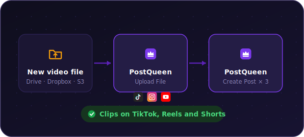
</p>

Set-up, nine example workflows and the full operation list live in the [n8n node repo »](https://github.com/GkhanKINAY/postqueen-n8n)

<a href="https://api.postqueen.ai/docs">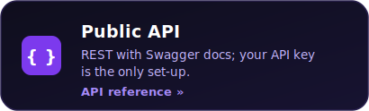</a> <a href="https://github.com/GkhanKINAY/postqueen-n8n">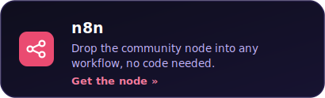</a> <a href="https://docs.postqueen.ai/automation/make">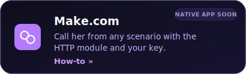</a> <a href="https://docs.postqueen.ai/automation/zapier">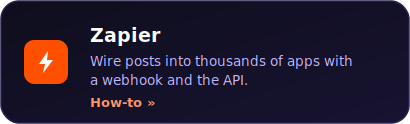</a>

<br/>

<p align="center"></p>

<br/>

## 🌙 An agent that works while you sleep

She does not clock out when you do. Agents like **Hermes** and **OpenClaw** can run on a schedule, not just on demand: a small recurring job wakes up before you, checks yesterday's numbers with `analytics:platform`, and has today's post drafted while your coffee is still brewing. Each of those steps is a CLI command or an MCP call with JSON output, so any agent that can run a command can hold down the night shift.

<p align="center">
  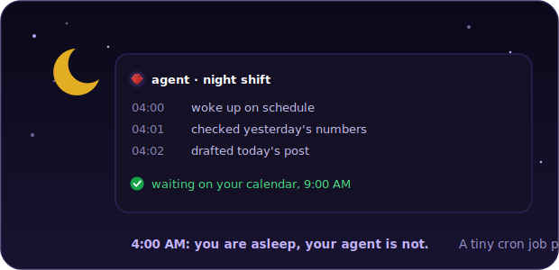
</p>

**Gemini CLI, Aider and your own cron scripts qualify too.** Start from the [Agent guide](https://postqueen.ai/agent) or the [MCP guide](https://postqueen.ai/mcp), and find the full command reference in [postqueen-agent](https://github.com/GkhanKINAY/postqueen-agent).

<br/>

---

## 👥 Who is she for?

If posting is part of your job but not your whole job, she is for you. Creators use her to stay visible without living inside the apps. Founders hand her the brand account and get back to running the business. Developers and automation teams treat her as a building block, one more thing their agents and pipelines can do:

<p align="center">
  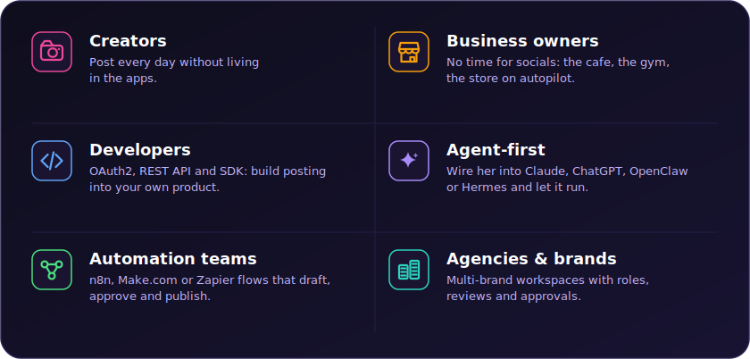
</p>

<br/>

---

## 👑 What she takes off your plate

Everything below ships today, in the cloud and in the open-source code. We call her the queen of your posts because she earns the crown: she writes sharper hooks than you would at 11 PM, she never forgets a posting slot, and she shows up every single day, which is the part we humans are worst at.

<br/>

<p align="center"></p>

<br/>

### One calendar, every channel

Write a post once and she reshapes it for every platform you are on, within each network's limits and habits. If you like, each version goes out on its own day and time. Point her at your blog's RSS feed and she takes over from there: she checks it every hour and turns each new article into a round of posts.

<p align="center">
  
</p>

<br/>

<p align="center"></p>

<br/>

### She writes, designs and films

Give her a topic and she comes back with the whole package: a hook that stops the scroll, a caption in your voice and an image that matches your brand. Want a video too? She adds a short vertical one with an AI voiceover. And she creates in whatever language you speak to her, with the interface itself translated into 16 of them.

<p align="center">
  
</p>

<br/>

<p align="center"></p>

<br/>

### She keeps score and keeps working

She watches the numbers so you do not have to: follower growth, impressions and per-post engagement live right beside your calendar. And when a post takes off, she keeps it moving, reposting it or adding a follow-up comment the moment it crosses the like milestone you set:

<p align="center">
  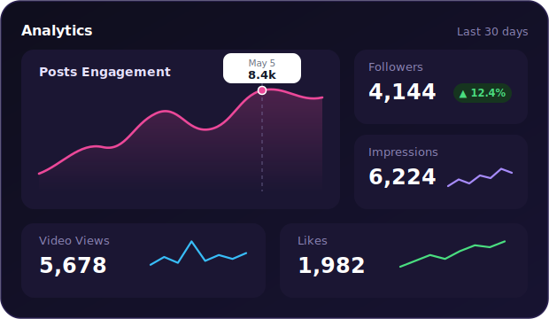
</p>

<br/>

<p align="center"></p>

<br/>

#### 🤝 Teamwork

She works well with humans too. Invite the team with roles and a shared calendar, keep every brand in its own workspace, and talk it all through in comments on the posts themselves.

<p align="center">
  
</p>

All of it is open source under AGPL-3.0. Use the managed cloud, or run the whole thing on your own server: same code, same queen.

<br/>

---

## ⚙️ How she works

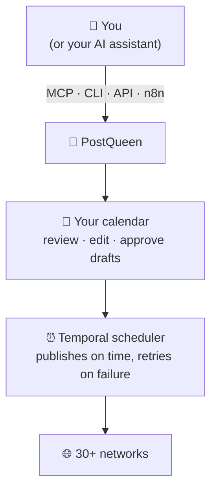

1. **You say it once**, from the app, a chat or your terminal.
2. **She does the work**: research, copy shaped to each platform, and an image or video to match.
3. **The calendar is yours**: let it run on autopilot, edit anything before it goes out, or ask for drafts and approve each post yourself.
4. **It goes out on time**, every time. A [Temporal](https://temporal.io) workflow engine fires each post exactly when planned, retries on failure, and quietly refreshes your platform tokens in the background.

Curious about the internals? Read [how it works](https://docs.postqueen.ai/howitworks) in the docs.

<br/>

---

## 🚀 Get started in minutes

<br/>

<p align="center"></p>

<br/>

### ☁️ Cloud, the fast lane

Skip the setup entirely: create an account, connect your channels, and your first post can go out today. The **7-day trial** is free, and there is nothing to install or maintain.

<p align="center">
  <a href="https://postqueen.ai"></a>
</p>

<br/>

<p align="center"></p>

<br/>

### 🐳 Self-host, the free lane

Some people love running their own tools, and she is happy to move in. The whole stack comes up on your machine with Docker in a few minutes, and it stays free forever, every connector and every feature included:

```bash
git clone https://github.com/GkhanKINAY/postqueen-docker-compose
cd postqueen-docker-compose
# set a unique JWT_SECRET and your public URLs in docker-compose.yaml
docker compose up -d          # then open http://localhost:4007
```

<p align="center">
  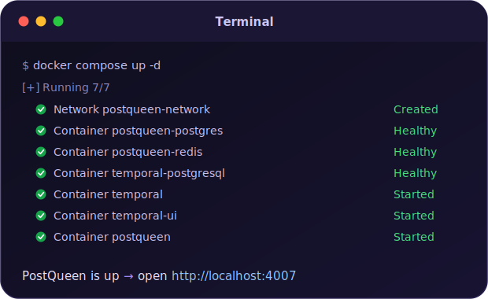
</p>

You will need Docker and about 4 GB of RAM. To connect real social accounts you will also need a public HTTPS domain behind a reverse proxy: the networks send their OAuth callbacks there. The stack ships the app and its backing services: PostgreSQL, Redis and Temporal.

Full walkthrough: [self-host guide](https://docs.postqueen.ai/installation/docker-compose) &nbsp;·&nbsp; Kubernetes: [postqueen-helmchart](https://github.com/GkhanKINAY/postqueen-helmchart) &nbsp;·&nbsp; every setting: [configuration reference](https://docs.postqueen.ai/configuration/reference)

<br/>

---

## 🌐 Publish everywhere

One post from you, and she is everywhere at once. PostQueen publishes to **30+ networks** out of the box:

<p align="center">
                               
</p>

| Category | Networks |
| --- | --- |
| **Major social** | X, LinkedIn, Instagram, Facebook, TikTok, YouTube, Threads, Pinterest, Reddit, Bluesky |
| **Community and chat** | Discord, Slack, Telegram, Mastodon, Twitch, Kick, MeWe, VK |
| **Publishing and blogs** | WordPress, Medium, Dev.to, Hashnode, Tumblr, Listmonk, Moltbook |
| **Web3 and decentralized** | Nostr, Farcaster, Lemmy |
| **Creator and business** | Google Business Profile, Whop, Skool, Dribbble |

LinkedIn and Instagram each support both personal and page posting. New connectors ship regularly: see the full list with per-network guides at [postqueen.ai/channels](https://postqueen.ai/channels).

<br/>

---

## 🛠️ For developers and builders

Scheduling, media and analytics are all public API calls, which is why agents drive her so well. Pick your surface:

<br/>

<p align="center"></p>

<br/>

### 1. Get your API key

1. Open **[app.postqueen.ai/settings](https://app.postqueen.ai/settings)** (or your self-hosted instance).
2. Go to **Developers → Public API**.
3. Click **Reveal**, copy your key, and keep it secret: it grants full access to your account.

```bash
export POSTQUEEN_API_KEY="your_api_key"
```

<br/>

<p align="center"></p>

<br/>

### 2. Connect over MCP

The [Model Context Protocol](https://modelcontextprotocol.io) lets AI assistants call tools, and PostQueen ships a hosted MCP server with **10 of them**. Your assistant can read each platform's posting rules, schedule posts, and generate the images and video to go with them. Point any MCP client at the server and social media becomes something your assistant simply knows how to do.

```bash
# Claude Code, one line:
claude mcp add --transport http postqueen https://api.postqueen.ai/mcp/<YOUR_API_KEY>
```

```json
{
  "mcpServers": {
    "postqueen": { "url": "https://api.postqueen.ai/mcp/<YOUR_API_KEY>" }
  }
}
```

Full guide with per-client steps: [postqueen.ai/mcp](https://postqueen.ai/mcp) &nbsp;·&nbsp; tool reference: [docs](https://docs.postqueen.ai/mcp/tools)

<br/>

<p align="center"></p>

<br/>

### 3. Script it with the CLI

The `postqueen` CLI handles posts, media and analytics from any shell, and it always returns clean JSON, which makes it equally good for shell scripts and AI agents:

```bash
npm i -g postqueen
export POSTQUEEN_API_KEY=your_api_key   # from app.postqueen.ai/settings
postqueen integrations:list
postqueen posts:create -c "Hello world 👑" -s "2026-08-01T09:00:00Z" -i <integration-id>
```

Full command reference: [postqueen-agent](https://github.com/GkhanKINAY/postqueen-agent) &nbsp;·&nbsp; [CLI docs](https://docs.postqueen.ai/cli/introduction)

<br/>

<p align="center"></p>

<br/>

### 4. Call the API or the SDK

REST at `https://api.postqueen.ai/public/v1`, with your API key as the `Authorization` header:

<p align="center">
  
</p>

```bash
curl https://api.postqueen.ai/public/v1/integrations \
  -H "Authorization: $POSTQUEEN_API_KEY"
```

Schedule a post to two networks at once:

```bash
curl -X POST https://api.postqueen.ai/public/v1/posts \
  -H "Authorization: $POSTQUEEN_API_KEY" \
  -H "Content-Type: application/json" \
  -d '{
    "type": "schedule",
    "date": "2026-08-01T09:00:00.000Z",
    "shortLink": false,
    "tags": [],
    "posts": [
      {
        "integration": { "id": "x-integration-id" },
        "value": [{ "content": "We just shipped dark mode 🌙" }],
        "settings": { "__type": "x", "who_can_reply_post": "everyone" }
      },
      {
        "integration": { "id": "linkedin-integration-id" },
        "value": [{ "content": "Dark mode is here. Here is why we built it." }],
        "settings": { "__type": "linkedin" }
      }
    ]
  }'
```

Prefer typed code? The same API through the [NodeJS SDK](https://www.npmjs.com/package/@postqueen/node):

```typescript
import PostQueen from '@postqueen/node';

const postqueen = new PostQueen(process.env.POSTQUEEN_API_KEY!);

const channels = (await postqueen.integrations()) as { id: string; name: string }[];

await postqueen.post({
  type: 'schedule',
  date: '2026-08-01T09:00:00.000Z',
  shortLink: false,
  tags: [],
  posts: [
    {
      integration: { id: channels[0].id },
      value: [{ content: 'We just shipped 🎉', image: [] }],
    },
  ],
});
```

<br/>

<p align="center"></p>

<br/>

### 5. Automate without code

| Tool | What it is | Get started |
| --- | --- | --- |
| **n8n node** | Drop PostQueen into any n8n workflow | [postqueen-n8n](https://github.com/GkhanKINAY/postqueen-n8n) · [`n8n-nodes-postqueen`](https://www.npmjs.com/package/n8n-nodes-postqueen) |
| **Public API** | REST, 22 endpoints, Swagger included | [API reference](https://api.postqueen.ai/docs) · [docs](https://docs.postqueen.ai/public-api/introduction) |
| **NodeJS SDK** | Typed client for Node | [`@postqueen/node`](https://www.npmjs.com/package/@postqueen/node) |
| **Webhooks** | Get notified when posts publish | [configuration reference](https://docs.postqueen.ai/configuration/reference) |

The same API plugs into Make.com, Zapier or your own cron jobs.

<br/>

---

## 🧱 Under the hood

- **pnpm workspaces** monorepo
- **[Next.js](https://nextjs.org)** (React) frontend
- **[NestJS](https://nestjs.com)** backend API
- **[Prisma](https://www.prisma.io)** ORM on **PostgreSQL**
- **[Temporal](https://temporal.io)** for durable scheduling: posts fire on time even through crashes and restarts
- **Redis** for cache and queues
- **[Resend](https://resend.com)** for email notifications

<br/>

---

## 🛡️ Compliance

- PostQueen is an open-source, self-hostable social media scheduler that supports X, LinkedIn, Instagram, Bluesky, Mastodon, Discord and 30+ more.
- The hosted service uses official, platform-approved OAuth flows.
- PostQueen does not automate or scrape content from social media platforms.
- PostQueen does not collect, store, or proxy API keys or access tokens from users.
- PostQueen never asks users to paste social-platform credentials into the hosted product.
- Users always authenticate directly with each platform (X, LinkedIn, Discord, and so on), which keeps every platform's compliance and your data privacy intact.

<br/>

---

## ❤️ Community and support

- 🐛 **Found a bug or have an idea?** [Open an issue](https://github.com/GkhanKINAY/postqueen-app/issues).
- 💌 **Need a hand?** Email **support@postqueen.ai**.
- 📚 **Getting started?** The [docs](https://docs.postqueen.ai) walk you through everything.
- 🤝 **Want to contribute?** Start with the [contribution guide](https://github.com/GkhanKINAY/postqueen-app/blob/main/CONTRIBUTING.md); security reports go to [SECURITY.md](https://github.com/GkhanKINAY/postqueen-app/blob/main/SECURITY.md).

If PostQueen saves you time, a ⭐ on the repo genuinely helps other people find it.

<br/>

---

## 🙏 Thank you, Postiz

PostQueen is a fork of [Postiz](https://github.com/gitroomhq/postiz-app) by Nevo David, released under AGPL-3.0. Postiz gave us a rock-solid open-source scheduler: the connectors, the calendar, the Temporal pipeline, years of careful work that we did not have to redo. We forked it because we wanted to take that foundation in a specific direction, a social media manager you talk to instead of operate, and building on Postiz let us start from something that already worked.

Thank you, Nevo David and every Postiz contributor. This project exists because you chose to open-source yours. If PostQueen is not quite what you need, [Postiz](https://postiz.com) itself might be, and it deserves your star too. 🙏

<br/>

---

## 👑 The PostQueen ecosystem

| Repository | What lives there |
| --- | --- |
| [postqueen-app](https://github.com/GkhanKINAY/postqueen-app) | The application itself: frontend, backend, workers |
| [postqueen-agent](https://github.com/GkhanKINAY/postqueen-agent) | Agent CLI and skill: give any AI assistant hands |
| [postqueen-docker-compose](https://github.com/GkhanKINAY/postqueen-docker-compose) | Self-host the whole stack with one command |
| [postqueen-helmchart](https://github.com/GkhanKINAY/postqueen-helmchart) | Run it on Kubernetes |
| [postqueen-n8n](https://github.com/GkhanKINAY/postqueen-n8n) | The n8n community node for no-code automation |
| [postqueen-docs](https://github.com/GkhanKINAY/postqueen-docs) | Source of [docs.postqueen.ai](https://docs.postqueen.ai) |

On npm: [`postqueen`](https://www.npmjs.com/package/postqueen) (CLI) · [`@postqueen/node`](https://www.npmjs.com/package/@postqueen/node) (SDK) · [`n8n-nodes-postqueen`](https://www.npmjs.com/package/n8n-nodes-postqueen) (n8n)

<br/>

<p align="center">
  <strong>Long live the queen.</strong> 👑
</p>

<p align="center">
  <a href="https://postqueen.ai"></a>
  &nbsp;&nbsp;
  <a href="https://github.com/GkhanKINAY/postqueen-docker-compose"></a>
</p>

## License

This repository's source code is available under the [AGPL-3.0 license](LICENSE). Original work © Nevo David / Gitroom and the Postiz contributors. Modifications © PostQueen.
