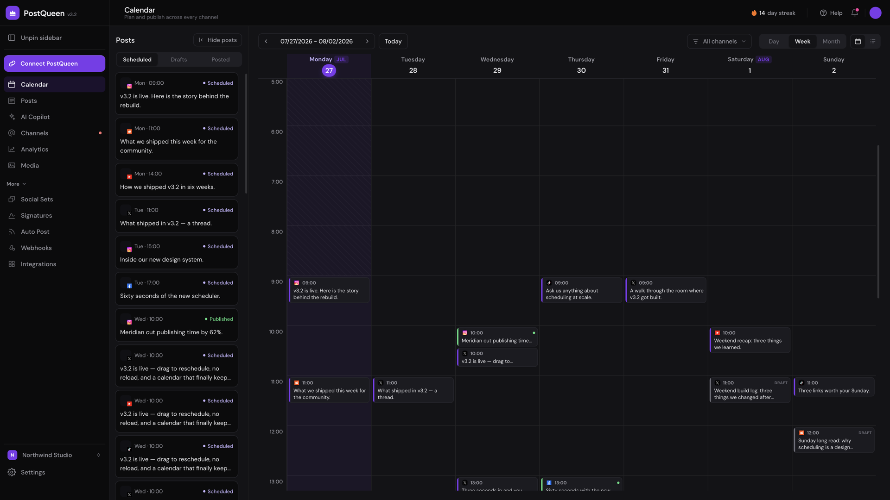

# PostQueen

PostQueen is a social media scheduler with an AI copilot. Plan, write and schedule posts to 30+ networks from the calendar, your AI agent or the API.

<p>
  <a href="https://postqueen.ai">Website</a> ·
  <a href="https://postqueen.ai/pricing">Pricing</a> ·
  <a href="https://docs.postqueen.ai/introduction">Docs</a> ·
  <a href="https://api.postqueen.ai/docs">API reference</a> ·
  <a href="LICENSE">AGPL-3.0</a>
</p>



## What it does

- Puts every channel on one calendar. Write a post once, adjust it per network, then schedule it, keep it as a draft or publish it now.
- Drafts posts and generates images with the AI copilot inside the app.
- Shows analytics for the networks that report them: X, Facebook, Instagram, LinkedIn Pages, YouTube, Threads, Pinterest, TikTok and Google Business Profile.
- Lets a team work in one workspace, with roles, customers and comments on posts. Team members come with the Growth plan and up.
- Gives agents and scripts the same abilities through an MCP server, a CLI, a REST API, a Node SDK and an n8n node.

## Quick start

**Use the hosted service.** Create an account, connect your channels and schedule your first post today. [Start a 7-day trial, $0 due today](https://postqueen.ai/pricing). A card is required, and you are not charged if you cancel before the trial ends.

**Connect from code.** Every route below uses your workspace API key. In PostQueen, open Connections > API Keys to copy it. Only workspace admins can see the key, and each workspace has one.

```bash
# An AI agent over MCP (Claude Code shown)
claude mcp add --transport http postqueen https://api.postqueen.ai/mcp/YOUR_API_KEY

# The CLI (Node.js 18 or newer)
npm install -g postqueen
export POSTQUEEN_API_KEY=YOUR_API_KEY
postqueen integrations:list

# The REST API: the raw key goes in the Authorization header, with no Bearer prefix
curl https://api.postqueen.ai/public/v1/integrations -H "Authorization: YOUR_API_KEY"
```

## Ways in

| Route | Use it for | Start here |
| --- | --- | --- |
| App | Calendar, composer, copilot, analytics, team | [app.postqueen.ai](https://app.postqueen.ai) |
| MCP | AI agents such as Claude, ChatGPT, Cursor and Codex | [MCP guide](https://docs.postqueen.ai/mcp/introduction) |
| CLI | Terminals, scripts and coding agents | [postqueen-agent](https://github.com/GkhanKINAY/postqueen-agent) |
| REST API | Your own code | [API reference](https://api.postqueen.ai/docs) · [API guide](https://docs.postqueen.ai/public-api/introduction) |
| Node SDK | Typed calls from Node.js | [`@postqueen/node`](https://www.npmjs.com/package/@postqueen/node) · [SDK guide](https://docs.postqueen.ai/public-api/sdk) |
| n8n | No-code workflows | [postqueen-n8n](https://github.com/GkhanKINAY/postqueen-n8n) |

### Connect an AI agent over MCP

There are two ways to connect. Each agent's guide says which one it supports.

- **Sign in.** Add `https://api.postqueen.ai/mcp-oauth-dynamic` to your agent, then sign in to PostQueen and approve access. A workspace admin has to approve. This address has 20 tools.
- **API key.** Add `https://api.postqueen.ai/mcp/YOUR_API_KEY`, using the key from Connections > API Keys. This address has 21 tools: the same 20 plus `ask_postqueen`, which hands a whole request to the PostQueen agent.

For Grok Bot, ask the Bot to connect PostQueen as an MCP server at `https://api.postqueen.ai/mcp`. Then paste your key into the Bot's secure prompt, never into the chat.

Setup guides cover Claude, Claude Cowork, ChatGPT, Grok, Grok Bot, Claude Code, Codex, Cursor, Gemini CLI, OpenClaw, Hermes Agent, VS Code, Devin Desktop, Zed, Grok Build, Muse Code, Muse, Perplexity Computer, NanoClaw and Paperclip. Start at the [agents overview](https://docs.postqueen.ai/agents/overview).

## Networks

PostQueen supports 30+ networks. This is their status on the hosted service at postqueen.ai:

- **Available:** Bluesky, DEV, Hashnode, Lemmy, Listmonk, Moltbook, Nostr and WordPress.
- **Available, with limits until the network approves PostQueen's app:** Facebook Pages, Instagram (Business and Creator accounts), Threads, TikTok, X and YouTube.
- **Soon on the hosted service:** Discord, Dribbble, Farcaster, Google Business Profile, Kick, LinkedIn and LinkedIn Pages, Mastodon, MeWe, Pinterest, Reddit, Skool, Slack, Telegram, TikTok Business, Tumblr, Twitch, VK and Whop.

On your own server, a network works once you create its developer app. The [provider guides](https://docs.postqueen.ai/providers/overview) cover each one.

## Self-hosting

PostQueen is open source under AGPL-3.0, so you can run it on your own server.

- [postqueen-docker-compose](https://github.com/GkhanKINAY/postqueen-docker-compose) runs the app with PostgreSQL, Redis and a Temporal cluster on one host.
- [postqueen-helmchart](https://github.com/GkhanKINAY/postqueen-helmchart) runs it on Kubernetes, with a Temporal server you provide.

The [self-hosting guide](https://docs.postqueen.ai/installation/overview) explains both.

## Repository layout

This is a pnpm workspace: Next.js on the frontend, NestJS on the backend, Prisma on PostgreSQL, Temporal for scheduling and Redis as a cache.

| Path | What lives there |
| --- | --- |
| `apps/frontend` | The Next.js web app |
| `apps/backend` | The NestJS API, including the public API and the MCP server |
| `apps/orchestrator` | Temporal workflows and activities: publishing, retries and token refresh |
| `apps/commands` | Maintenance commands that run outside the API |
| `apps/extension` | The browser extension some channels connect through |
| `apps/sdk` | The `@postqueen/node` SDK |
| `libraries` | Code shared by the apps: server services, network providers, helpers and React components |

To run it from source, follow [CONTRIBUTING.md](CONTRIBUTING.md) and the [development guide](https://docs.postqueen.ai/installation/development).

## Privacy and security

- Channels connect through each network's official OAuth sign-in where the network offers one.
- Some networks, such as Bluesky, Lemmy, WordPress and Nostr, need an app password or a key that you paste in.
- PostQueen stores these credentials so it can post for you, and replaces them when you remove the channel.
- Read the [privacy policy](https://postqueen.ai/privacy-policy), or [delete your account](https://postqueen.ai/delete-my-account).
- To report a vulnerability, see [SECURITY.md](SECURITY.md).

## Links

| | |
| --- | --- |
| Hosted service | [postqueen.ai](https://postqueen.ai) · [pricing](https://postqueen.ai/pricing) |
| Docs | [docs.postqueen.ai](https://docs.postqueen.ai/introduction) |
| API reference | [api.postqueen.ai/docs](https://api.postqueen.ai/docs) |
| Repositories | [app](https://github.com/GkhanKINAY/postqueen-app) · [CLI and skill](https://github.com/GkhanKINAY/postqueen-agent) · [n8n node](https://github.com/GkhanKINAY/postqueen-n8n) · [docs](https://github.com/GkhanKINAY/postqueen-docs) · [Docker Compose](https://github.com/GkhanKINAY/postqueen-docker-compose) · [Helm chart](https://github.com/GkhanKINAY/postqueen-helmchart) |
| npm | [`postqueen`](https://www.npmjs.com/package/postqueen) · [`@postqueen/node`](https://www.npmjs.com/package/@postqueen/node) · [`n8n-nodes-postqueen`](https://www.npmjs.com/package/n8n-nodes-postqueen) |
| Releases | [tags](https://github.com/GkhanKINAY/postqueen-app/tags) |
| Help | support@postqueen.ai · [GitHub issues](https://github.com/GkhanKINAY/postqueen-app/issues) |

## License

PostQueen is open source under the [AGPL-3.0 license](LICENSE). It started as a fork of [Postiz](https://github.com/gitroomhq/postiz-app) by Nevo David. Original work © Nevo David / Gitroom and the Postiz contributors. Modifications © PostQueen.
