<p align="center">
  <a href="https://app.postqueen.ai/auth?utm_source=github&utm_medium=readme&utm_campaign=postqueen-app&utm_content=hero-banner">
    <picture>
      <source media="(prefers-color-scheme: dark)" srcset=".github/assets/banner-dark.png">
      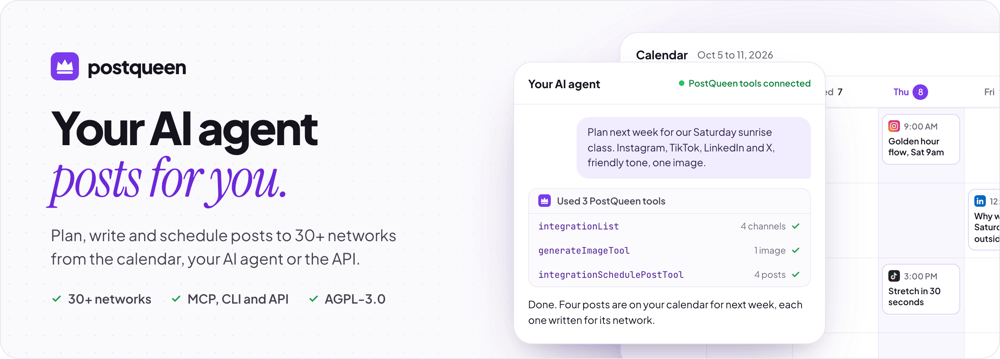
    </picture>
  </a>
</p>

<p align="center">
  <a href="https://docs.postqueen.ai/agents/grok-bot"><picture><source media="(prefers-color-scheme: dark)" srcset=".github/assets/showcase/announce-dark.png">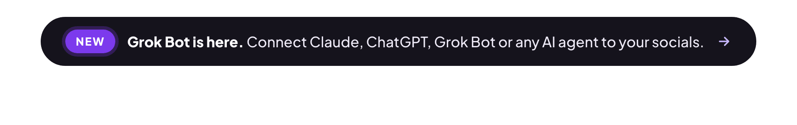</picture></a>
</p>

<h1 align="center">PostQueen: the AI social media scheduler</h1>

<p align="center">
  Schedule posts to Instagram, TikTok, YouTube, X, LinkedIn and more, 30+ networks, from one calendar.<br>
  Or ask <b>Claude</b>, <b>ChatGPT</b>, <b>Grok Bot</b> or any AI agent to do it through PostQueen's MCP server.<br>
  An open-source alternative to Buffer, Hootsuite, Later and Sprout Social.
</p>

<p align="center">
  <a href="https://app.postqueen.ai/auth?utm_source=github&utm_medium=readme&utm_campaign=postqueen-app&utm_content=hero-button"><picture><source media="(prefers-color-scheme: dark)" srcset=".github/assets/showcase/btn-trial-dark.png">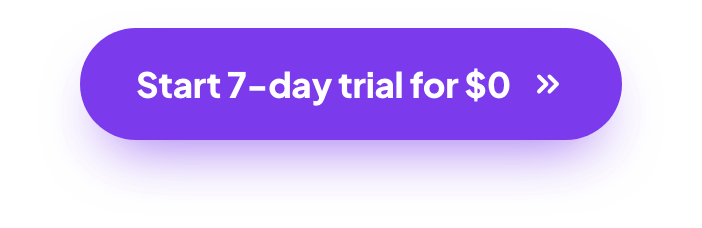</picture></a><a href="https://docs.postqueen.ai/agents/overview"><picture><source media="(prefers-color-scheme: dark)" srcset=".github/assets/showcase/btn-agent-dark.png"></picture></a>
</p>

<p align="center">
  <sub><b>$0 due today.</b> A card is required, and you pay nothing if you cancel within 7 days.</sub>
</p>

<p align="center">
  <a href="https://postqueen.ai/?utm_source=github&utm_medium=readme&utm_campaign=postqueen-app"><b>Website</b></a> ·
  <a href="https://postqueen.ai/pricing?utm_source=github&utm_medium=readme&utm_campaign=postqueen-app"><b>Pricing</b></a> ·
  <a href="https://docs.postqueen.ai/introduction"><b>Docs</b></a> ·
  <a href="https://docs.postqueen.ai/mcp/introduction"><b>MCP</b></a> ·
  <a href="https://github.com/GkhanKINAY/postqueen-agent"><b>CLI</b></a> ·
  <a href="https://api.postqueen.ai/docs"><b>API</b></a> ·
  <a href="https://github.com/GkhanKINAY/postqueen-n8n"><b>n8n</b></a>
</p>

<p align="center">
  <a href="https://github.com/GkhanKINAY/postqueen-app/releases"></a>
  <a href="LICENSE"></a>
  <a href="https://www.npmjs.com/package/postqueen"></a>
  <a href="https://www.npmjs.com/package/n8n-nodes-postqueen"></a>
  <a href="https://www.forbes.com/profile/gokhan-kinay/"></a>
</p>

<p align="center">
  <a href="https://docs.postqueen.ai/agents/overview"><picture><source media="(prefers-color-scheme: dark)" srcset=".github/assets/showcase/works-dark.png">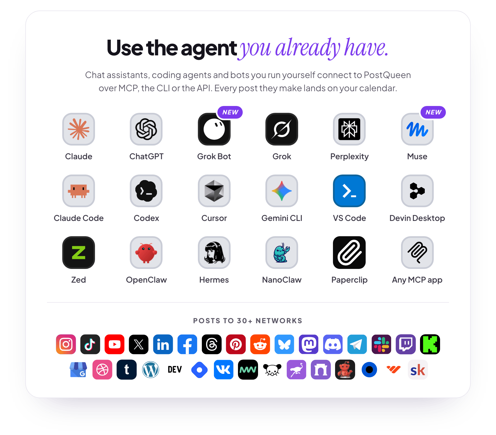</picture></a>
</p>

## Why PostQueen

<p align="center">
  <a href="https://app.postqueen.ai/auth?utm_source=github&utm_medium=readme&utm_campaign=postqueen-app&utm_content=why"><picture><source media="(prefers-color-scheme: dark)" srcset=".github/assets/showcase/why-dark.png">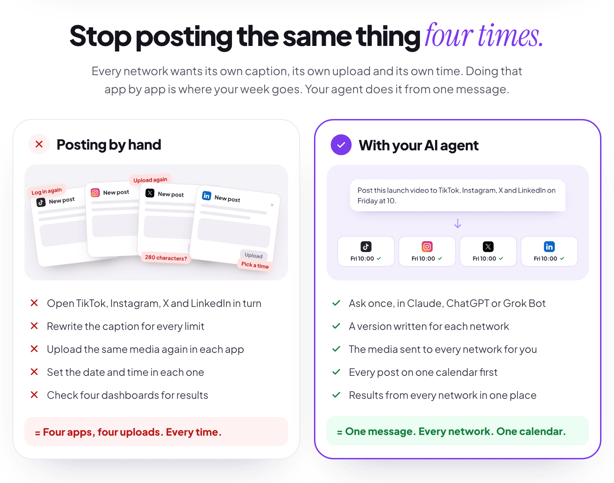</picture></a>
</p>

## What it does

- **One calendar for every channel.** Write a post once, adjust it for each network, then schedule it, keep it as a draft or publish it now. Repeat a post on an interval, preview it, and comment on it with your team.
- **Your AI agent does the posting.** Claude, ChatGPT, Grok Bot, Claude Code, Cursor and other agents list your channels, write and schedule posts, add images and video, and read results, all through the MCP server.
- **AI in the composer.** The AI copilot drafts and rewrites posts. Generate images, and videos with Seedance or narrated image slides. Make avatar videos with your own HeyGen account.
- **Analytics** for the networks that report them: X, Facebook, Instagram, LinkedIn Pages, YouTube, Threads, Pinterest, TikTok and Google Business Profile.
- **Automation.** Auto Post publishes new items from your RSS feeds, Auto-Plugs reply or repost once a post takes off, webhooks tell your own systems when a post goes out, and time slots pick the next free time.
- **Teams and clients.** Workspaces with roles, customers to group channels by client, signatures, reusable sets and notifications.

<picture>
  <source media="(prefers-color-scheme: dark)" srcset=".github/assets/app-preview-dark.png">
  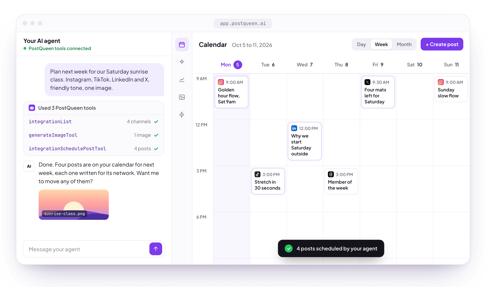
</picture>

## Four ways to post

<table>
  <tr>
    <td width="50%" valign="top">
      <a href="https://app.postqueen.ai/auth?utm_source=github&utm_medium=readme&utm_campaign=postqueen-app&utm_content=way-app"><picture><source media="(prefers-color-scheme: dark)" srcset=".github/assets/showcase/way-app-dark.png">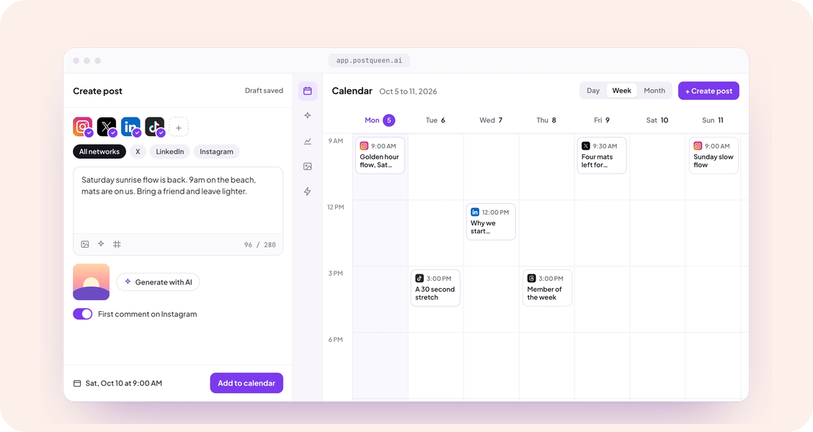</picture></a>
      <h3>In the app</h3>
      Connect your channels, write a post once and schedule it for each of them on the calendar.<br>
      <a href="https://app.postqueen.ai/auth?utm_source=github&utm_medium=readme&utm_campaign=postqueen-app&utm_content=way-app-link"><b>Start your trial →</b></a>
    </td>
    <td width="50%" valign="top">
      <a href="https://docs.postqueen.ai/agents/overview"><picture><source media="(prefers-color-scheme: dark)" srcset=".github/assets/showcase/way-agent-dark.png">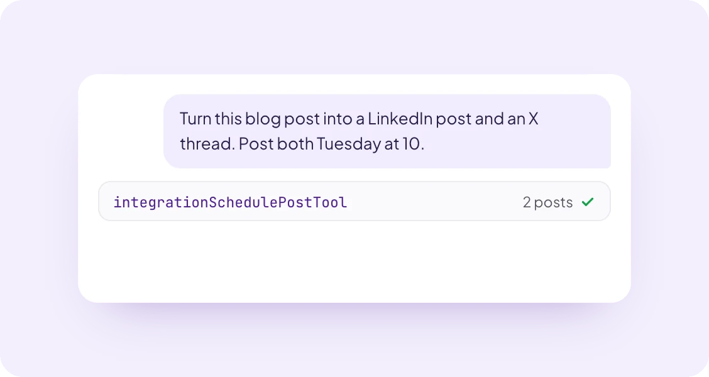</picture></a>
      <h3>From an AI agent</h3>
      Ask Claude, ChatGPT, Grok Bot or another agent in plain words. It posts through PostQueen's MCP server.<br>
      <a href="https://docs.postqueen.ai/agents/overview"><b>Connect your agent →</b></a>
    </td>
  </tr>
  <tr>
    <td width="50%" valign="top">
      <a href="https://github.com/GkhanKINAY/postqueen-agent"><picture><source media="(prefers-color-scheme: dark)" srcset=".github/assets/showcase/way-cli-dark.png">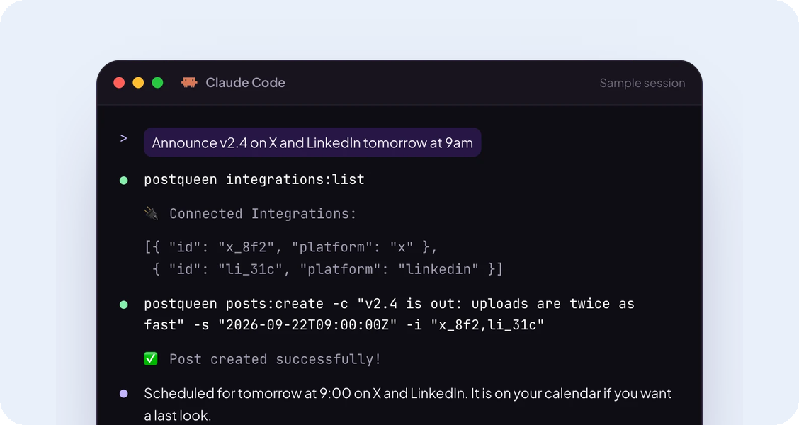</picture></a>
      <h3>From the CLI</h3>
      Schedule posts, upload media and read analytics from a terminal, a script or a coding agent.<br>
      <a href="https://github.com/GkhanKINAY/postqueen-agent"><b>postqueen CLI →</b></a>
    </td>
    <td width="50%" valign="top">
      <a href="https://docs.postqueen.ai/public-api/introduction"><picture><source media="(prefers-color-scheme: dark)" srcset=".github/assets/showcase/way-api-dark.png">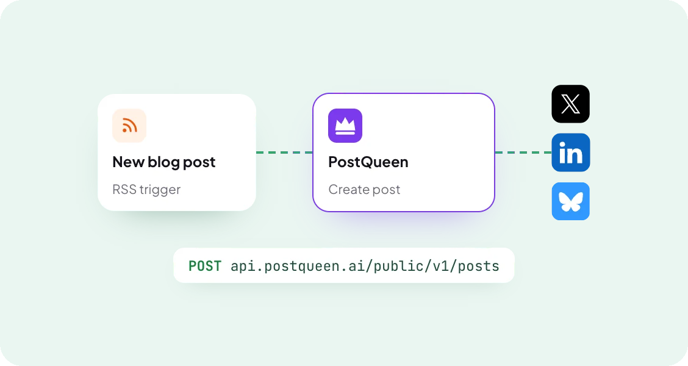</picture></a>
      <h3>Through the API</h3>
      Call the REST API or the Node SDK from your own code, or wire PostQueen into n8n.<br>
      <a href="https://docs.postqueen.ai/public-api/introduction"><b>API guide →</b></a>
    </td>
  </tr>
</table>

## AI agents

Connect PostQueen once, and your agent can list your channels, write and schedule posts, add images and videos, and read how your posts did. Every post it makes lands on your calendar, where you can check it before it goes out.

<table>
  <tr>
    <td width="33%" valign="top"><a href="https://docs.postqueen.ai/agents/grok-bot"><picture><source media="(prefers-color-scheme: dark)" srcset=".github/assets/showcase/agent-grok-bot-dark.png">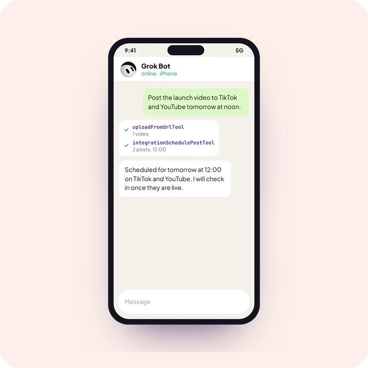</picture></a><br><b>Grok Bot</b> <br><sub>Ask it in chat, from the desktop app or your phone.</sub></td>
    <td width="33%" valign="top"><a href="https://docs.postqueen.ai/agents/claude"><picture><source media="(prefers-color-scheme: dark)" srcset=".github/assets/showcase/agent-claude-dark.png">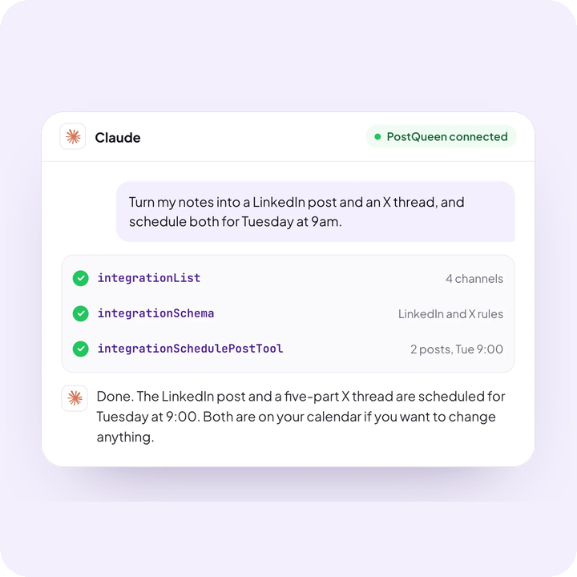</picture></a><br><b>Claude</b><br><sub>Add PostQueen as a custom connector.</sub></td>
    <td width="33%" valign="top"><a href="https://docs.postqueen.ai/agents/claude-code"><picture><source media="(prefers-color-scheme: dark)" srcset=".github/assets/showcase/agent-claude-code-dark.png">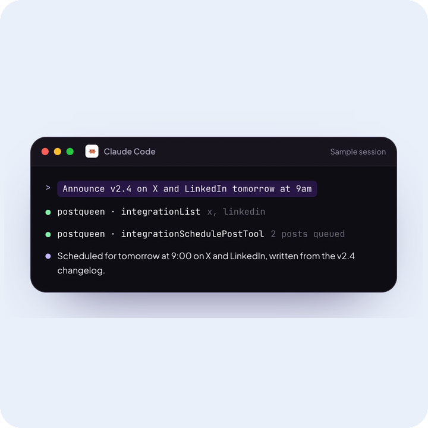</picture></a><br><b>Claude Code</b><br><sub>One command, then post from your terminal.</sub></td>
  </tr>
</table>


**Chat assistants and bots**

| | Agent | Made by | Connects with | Status | Guide |
| --- | --- | --- | --- | --- | --- |
|  | **Grok Bot**  | xAI | MCP, key in the Bot's secure prompt | ✓ Tested | [Guide](https://docs.postqueen.ai/agents/grok-bot) |
|  | **Claude** | Anthropic | MCP: key address or sign-in | ✓ Key address tested | [Guide](https://docs.postqueen.ai/agents/claude) |
|  | **ChatGPT** | OpenAI | MCP: key address or sign-in | ✓ Key address tested | [Guide](https://docs.postqueen.ai/agents/chatgpt) |
|  | **Claude Cowork** | Anthropic | MCP: key address or sign-in | Vendor's docs | [Guide](https://docs.postqueen.ai/agents/claude-cowork) |
|  | **Grok** | xAI | MCP: key address | Vendor's docs | [Guide](https://docs.postqueen.ai/agents/grok) |
|  | **Perplexity Computer** | Perplexity | MCP: key address | Vendor's docs | [Guide](https://docs.postqueen.ai/agents/perplexity-computer) |
|  | **Muse**  | Meta | Custom connector | Not possible yet | [Guide](https://docs.postqueen.ai/agents/muse) |

**Coding agents and editors**

| | Agent | Made by | Connects with | Status | Guide |
| --- | --- | --- | --- | --- | --- |
|  | **Claude Code** | Anthropic | MCP: key address, or the CLI and skill | Vendor's docs | [Guide](https://docs.postqueen.ai/agents/claude-code) |
|  | **Codex** | OpenAI | MCP: key address, or the CLI and skill | Vendor's docs | [Guide](https://docs.postqueen.ai/agents/codex) |
|  | **Cursor** | Anysphere | MCP config, or the CLI and skill | Vendor's docs | [Guide](https://docs.postqueen.ai/agents/cursor) |
|  | **Gemini CLI** | Google | MCP: key address, or the CLI and skill | Vendor's docs | [Guide](https://docs.postqueen.ai/agents/gemini-cli) |
|  | **Grok Build** | xAI | MCP: key address, or the CLI and skill | Vendor's docs | [Guide](https://docs.postqueen.ai/agents/grok-build) |
|  | **VS Code** | Microsoft | MCP config | Vendor's docs | [Guide](https://docs.postqueen.ai/agents/vscode) |
|  | **Devin Desktop** | Cognition | MCP config | Vendor's docs | [Guide](https://docs.postqueen.ai/agents/devin-desktop) |
|  | **Zed** | Zed Industries | MCP config | Vendor's docs | [Guide](https://docs.postqueen.ai/agents/zed) |
|  | **Muse Code** | Meta | MCP config | Vendor's docs | [Guide](https://docs.postqueen.ai/agents/muse-code) |

**Agents you run yourself**

| | Agent | Made by | Connects with | Status | Guide |
| --- | --- | --- | --- | --- | --- |
|  | **OpenClaw** | OpenClaw | The CLI and skill, from WhatsApp, Telegram, Slack or Discord | Vendor's docs | [Guide](https://docs.postqueen.ai/agents/openclaw) |
|  | **Hermes Agent** | Nous Research | MCP config | Vendor's docs | [Guide](https://docs.postqueen.ai/agents/hermes) |
|  | **NanoClaw** | NanoCo | MCP with a Bearer header | Vendor's docs | [Guide](https://docs.postqueen.ai/agents/nanoclaw) |
|  | **Paperclip** | Paperclip AI | MCP with a Bearer header | Vendor's docs | [Guide](https://docs.postqueen.ai/agents/paperclip) |

"Tested" means PostQueen ran the setup end to end (2026-09-19). The other guides follow each vendor's documented setup. Any other MCP client works with the same addresses: see [other MCP clients](https://docs.postqueen.ai/agents/other-mcp-clients).

**Connect in one line.** In PostQueen, open Connections > API Keys (workspace admins) to copy your key, or your agent's ready-made address:

```bash
claude mcp add --transport http postqueen https://api.postqueen.ai/mcp/YOUR_API_KEY
```

The key address has 21 tools: 20 for channels, posts, media, images, video and analytics, plus `ask_postqueen`, which hands a whole request to the PostQueen agent. Agents that support sign-in can use `https://api.postqueen.ai/mcp-oauth-dynamic` instead, with the same 20 tools; a workspace admin approves access. It is new and not tested end to end yet, so use the key if the sign-in fails. For Grok Bot, give the Bot `https://api.postqueen.ai/mcp` and paste the key into its secure prompt, never into the chat.

## PostQueen Cloud or self-hosted

**PostQueen Cloud is the fastest way to start**, and the recommended one. The same open-source app, run for you.

| | **PostQueen Cloud** (recommended) | Self-hosted |
| --- | --- | --- |
| Get started | Sign up and connect your channels in minutes | Docker Compose or Helm, with PostgreSQL, Redis, Temporal and storage |
| Network apps | PostQueen's own apps, so there is no developer account or app review on your side. A few networks are still in review: [status](https://docs.postqueen.ai/channels/overview) | You create a developer app on every network and get it approved. Meta, TikTok and YouTube reviews can take weeks |
| AI agents over MCP | Hosted at `api.postqueen.ai`: paste a key or sign in | You run and secure the MCP server on your own domain |
| AI copilot, images and video | Included, with monthly credits on every plan | Bring your own AI provider keys and pay each provider |
| Updates and backups | Automatic | You pull new images, run migrations and keep backups |
| Support | support@postqueen.ai | Community and GitHub issues, no guarantees |
| Price | 7-day trial, $0 due today, then your plan ([pricing](https://postqueen.ai/pricing?utm_source=github&utm_medium=readme&utm_campaign=postqueen-app)) | Free under AGPL-3.0, plus your servers |

<p align="center">
  <a href="https://app.postqueen.ai/auth?utm_source=github&utm_medium=readme&utm_campaign=postqueen-app&utm_content=cloud-table"><picture><source media="(prefers-color-scheme: dark)" srcset=".github/assets/showcase/btn-trial-dark.png"></picture></a><a href="https://docs.postqueen.ai/agents/overview"><picture><source media="(prefers-color-scheme: dark)" srcset=".github/assets/showcase/btn-agent-dark.png"></picture></a>
</p>

**Self-hosting instead?** [postqueen-docker-compose](https://github.com/GkhanKINAY/postqueen-docker-compose) runs the app with PostgreSQL, Redis and a Temporal cluster on one host, and [postqueen-helmchart](https://github.com/GkhanKINAY/postqueen-helmchart) runs it on Kubernetes with a Temporal server you provide. The [self-hosting guide](https://docs.postqueen.ai/installation/overview) covers both, and the [provider guides](https://docs.postqueen.ai/installation/providers/overview) cover each network's developer app.

## Channels

PostQueen posts to 30+ networks. Each one has its own page in the docs: what you can post to it, its limits, and whether you can connect it on PostQueen Cloud today.

| Type | | Networks |
| --- | --- | --- |
| **Social networks** | <a href="https://docs.postqueen.ai/channels/instagram"></a> <a href="https://docs.postqueen.ai/channels/tiktok"></a> <a href="https://docs.postqueen.ai/channels/facebook"></a> <a href="https://docs.postqueen.ai/channels/x-twitter"></a> <a href="https://docs.postqueen.ai/channels/linkedin"></a> <a href="https://docs.postqueen.ai/channels/threads"></a> <a href="https://docs.postqueen.ai/channels/bluesky"></a> <a href="https://docs.postqueen.ai/channels/reddit"></a> <a href="https://docs.postqueen.ai/channels/mastodon"></a> <a href="https://docs.postqueen.ai/channels/tumblr"></a> <a href="https://docs.postqueen.ai/channels/vk"></a> <a href="https://docs.postqueen.ai/channels/farcaster"></a> <a href="https://docs.postqueen.ai/channels/nostr"></a> <a href="https://docs.postqueen.ai/channels/lemmy"></a> <a href="https://docs.postqueen.ai/channels/mewe"></a> | [Instagram](https://docs.postqueen.ai/channels/instagram), [TikTok](https://docs.postqueen.ai/channels/tiktok), [Facebook](https://docs.postqueen.ai/channels/facebook), [X](https://docs.postqueen.ai/channels/x-twitter), [LinkedIn](https://docs.postqueen.ai/channels/linkedin), [Threads](https://docs.postqueen.ai/channels/threads), [Bluesky](https://docs.postqueen.ai/channels/bluesky), [Reddit](https://docs.postqueen.ai/channels/reddit), [Mastodon](https://docs.postqueen.ai/channels/mastodon), [Tumblr](https://docs.postqueen.ai/channels/tumblr), [VK](https://docs.postqueen.ai/channels/vk), [Farcaster](https://docs.postqueen.ai/channels/farcaster), [Nostr](https://docs.postqueen.ai/channels/nostr), [Lemmy](https://docs.postqueen.ai/channels/lemmy), [MeWe](https://docs.postqueen.ai/channels/mewe) |
| **Video and live** | <a href="https://docs.postqueen.ai/channels/youtube"></a> <a href="https://docs.postqueen.ai/channels/twitch"></a> <a href="https://docs.postqueen.ai/channels/kick"></a> | [YouTube](https://docs.postqueen.ai/channels/youtube), [Twitch](https://docs.postqueen.ai/channels/twitch), [Kick](https://docs.postqueen.ai/channels/kick) |
| **Business and discovery** | <a href="https://docs.postqueen.ai/channels/pinterest"></a> <a href="https://docs.postqueen.ai/channels/google-my-business"></a> <a href="https://docs.postqueen.ai/channels/dribbble"></a> | [Pinterest](https://docs.postqueen.ai/channels/pinterest), [Google Business Profile](https://docs.postqueen.ai/channels/google-my-business), [Dribbble](https://docs.postqueen.ai/channels/dribbble) |
| **Chat and communities** | <a href="https://docs.postqueen.ai/channels/telegram"></a> <a href="https://docs.postqueen.ai/channels/discord"></a> <a href="https://docs.postqueen.ai/channels/slack"></a> <a href="https://docs.postqueen.ai/channels/skool"></a> <a href="https://docs.postqueen.ai/channels/whop"></a> <a href="https://docs.postqueen.ai/channels/moltbook"></a> | [Telegram](https://docs.postqueen.ai/channels/telegram), [Discord](https://docs.postqueen.ai/channels/discord), [Slack](https://docs.postqueen.ai/channels/slack), [Skool](https://docs.postqueen.ai/channels/skool), [Whop](https://docs.postqueen.ai/channels/whop), [Moltbook](https://docs.postqueen.ai/channels/moltbook) |
| **Blogs and newsletters** | <a href="https://docs.postqueen.ai/channels/wordpress"></a> <a href="https://docs.postqueen.ai/channels/devto"></a> <a href="https://docs.postqueen.ai/channels/hashnode"></a> <a href="https://docs.postqueen.ai/channels/listmonk"></a> | [WordPress](https://docs.postqueen.ai/channels/wordpress), [DEV](https://docs.postqueen.ai/channels/devto), [Hashnode](https://docs.postqueen.ai/channels/hashnode), [Listmonk](https://docs.postqueen.ai/channels/listmonk) |

## For developers

Every route uses your workspace API key: open Connections > API Keys in PostQueen to copy it. Only workspace admins can see the key, and each workspace has one.

```bash
# The CLI (Node.js 20.19+ or 22.12+)
npm install -g postqueen
export POSTQUEEN_API_KEY=YOUR_API_KEY
postqueen integrations:list

# The REST API: the raw key goes in the Authorization header, with no Bearer prefix
curl https://api.postqueen.ai/public/v1/integrations -H "Authorization: YOUR_API_KEY"
```

| Route | Use it for | Start here |
| --- | --- | --- |
| App | Calendar, composer, copilot, analytics, team | [Start a 7-day trial](https://app.postqueen.ai/auth?utm_source=github&utm_medium=readme&utm_campaign=postqueen-app&utm_content=ways-in) |
| MCP | AI agents such as Claude, ChatGPT, Grok Bot, Cursor and Codex | [MCP guide](https://docs.postqueen.ai/mcp/introduction) |
| CLI | Terminals, scripts and coding agents | [postqueen-agent](https://github.com/GkhanKINAY/postqueen-agent) |
| REST API | Your own code | [API reference](https://api.postqueen.ai/docs) · [API guide](https://docs.postqueen.ai/public-api/introduction) |
| Node SDK | Typed calls from Node.js | [`@postqueen/node`](https://www.npmjs.com/package/@postqueen/node) · [SDK guide](https://docs.postqueen.ai/public-api/sdk) |
| n8n | No-code workflows | [postqueen-n8n](https://github.com/GkhanKINAY/postqueen-n8n) |

## Built by

<p align="center">
  <a href="https://www.forbes.com/profile/gokhan-kinay/"><picture><source media="(prefers-color-scheme: dark)" srcset=".github/assets/showcase/founder-dark.png">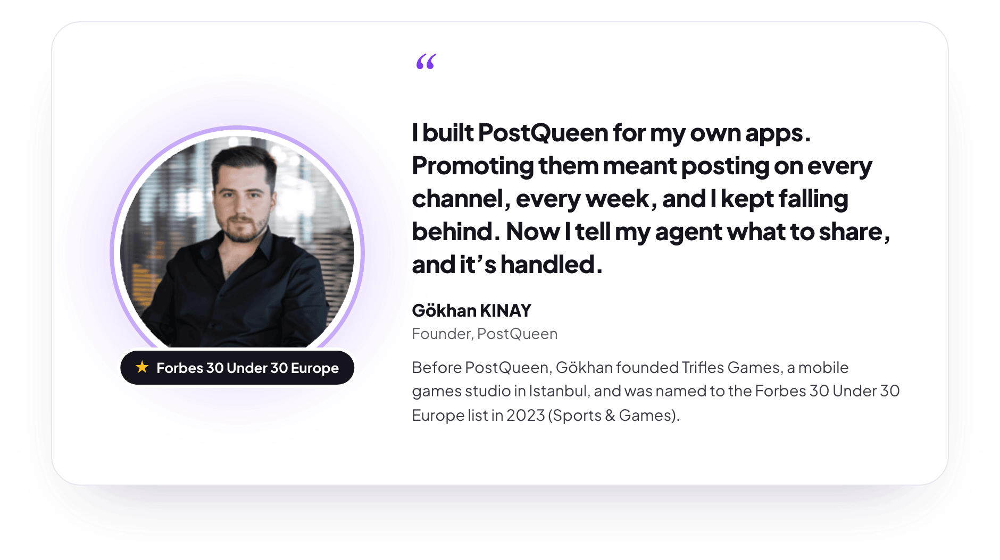</picture></a>
</p>

PostQueen is made by Forceplay OÜ, a software company in Tallinn, Estonia.

<p align="center">
  <a href="https://app.postqueen.ai/auth?utm_source=github&utm_medium=readme&utm_campaign=postqueen-app&utm_content=closing-band"><picture><source media="(prefers-color-scheme: dark)" srcset=".github/assets/showcase/cta-dark.png">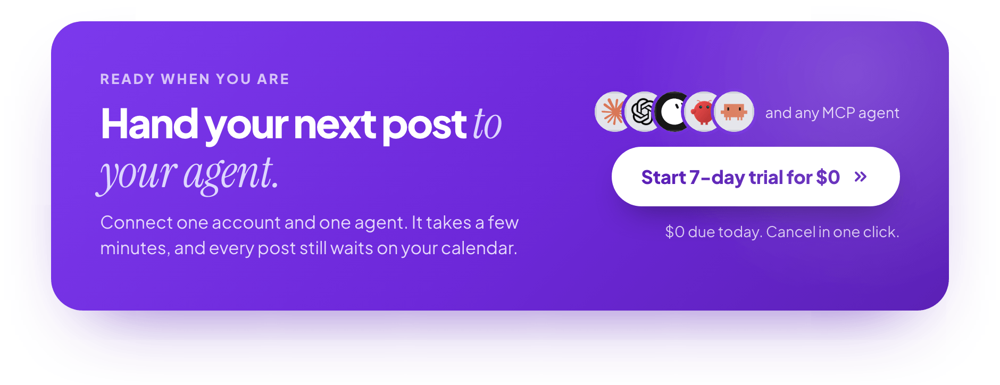</picture></a>
</p>

## Repository layout

This is a pnpm workspace: Next.js on the frontend, NestJS on the backend, Prisma on PostgreSQL, Temporal for scheduling and Redis as a cache.

| Path | What lives there |
| --- | --- |
| `apps/frontend` | The Next.js web app |
| `apps/backend` | The NestJS API, including the public API and the MCP server |
| `apps/orchestrator` | Temporal workflows and activities: publishing, retries and token refresh |
| `apps/commands` | Maintenance commands that run outside the API |
| `apps/extension` | The browser extension some channels connect through |
| `apps/sdk` | The `@postqueen/node` SDK |
| `libraries` | Code shared by the apps: server services, network providers, helpers and React components |

To run it from source, follow [CONTRIBUTING.md](CONTRIBUTING.md) and the [development guide](https://docs.postqueen.ai/installation/development).

## Privacy and security

- Channels connect through each network's official OAuth sign-in where the network offers one.
- Some networks, such as Bluesky, Lemmy, WordPress and Nostr, need an app password, an account password or a key that you paste in.
- PostQueen stores these credentials so it can post for you, and replaces them when you remove the channel.
- Read the [privacy policy](https://postqueen.ai/privacy-policy), or [delete your account](https://postqueen.ai/delete-my-account).
- To report a vulnerability, see [SECURITY.md](SECURITY.md).

## Links

| | |
| --- | --- |
| PostQueen Cloud | [Start a 7-day trial](https://app.postqueen.ai/auth?utm_source=github&utm_medium=readme&utm_campaign=postqueen-app&utm_content=links) · [pricing](https://postqueen.ai/pricing?utm_source=github&utm_medium=readme&utm_campaign=postqueen-app) · [postqueen.ai](https://postqueen.ai/?utm_source=github&utm_medium=readme&utm_campaign=postqueen-app) |
| Docs | [docs.postqueen.ai](https://docs.postqueen.ai/introduction) · [AI agents](https://docs.postqueen.ai/agents/overview) · [channels](https://docs.postqueen.ai/channels/overview) |
| API reference | [api.postqueen.ai/docs](https://api.postqueen.ai/docs) |
| Repositories | [app](https://github.com/GkhanKINAY/postqueen-app) · [CLI and skill](https://github.com/GkhanKINAY/postqueen-agent) · [n8n node](https://github.com/GkhanKINAY/postqueen-n8n) · [docs](https://github.com/GkhanKINAY/postqueen-docs) · [Docker Compose](https://github.com/GkhanKINAY/postqueen-docker-compose) · [Helm chart](https://github.com/GkhanKINAY/postqueen-helmchart) |
| npm | [`postqueen`](https://www.npmjs.com/package/postqueen) · [`@postqueen/node`](https://www.npmjs.com/package/@postqueen/node) · [`n8n-nodes-postqueen`](https://www.npmjs.com/package/n8n-nodes-postqueen) |
| Releases | [GitHub releases](https://github.com/GkhanKINAY/postqueen-app/releases) |
| Help | support@postqueen.ai · [GitHub issues](https://github.com/GkhanKINAY/postqueen-app/issues) |

## License

PostQueen is open source under the [AGPL-3.0 license](LICENSE). It started as a fork of [Postiz](https://github.com/gitroomhq/postiz-app) by Nevo David. Original work © Nevo David / Gitroom and the Postiz contributors. Modifications © PostQueen.
